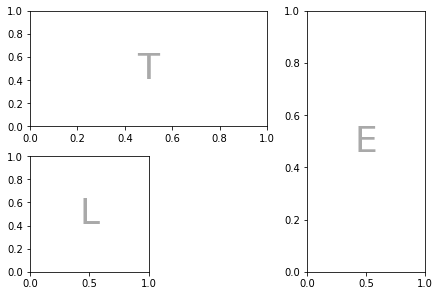
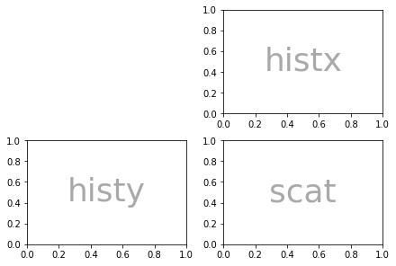
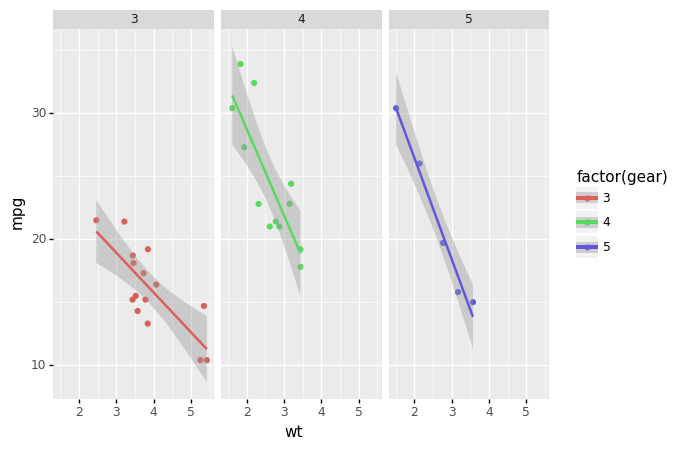

(Remember that to use these, you will need to run `pip install packagename` on the command line.)

## 1. Jazzit

Sound on for this one. Jazzit's docs say:
> "Ever wanted your scripts to play music while running/ on erroring out?  Of course you didn't. But here it is anyway".

Yes, this package laughs at you when you get a runtime error -- but can also celebrate your success when the code runs. Apart from being good fun, this package demonstrates how the decorator function `@` is used.

See also: [beepy](https://pypi.org/project/beepy/)

### Example of Jazzit

```python

from jazzit import error_track, success_track

@error_track("curb_your_enthusiasm.mp3", wait=9)
def run():
    print(1/0)

run()
```

```text
Traceback (most recent call last):
  File "/opt/anaconda3/envs/noodling/lib/python3.8/site-packages/jazzit/jazz.py", line 47, in wrapped_function
    original_func(*args)
  File "/var/folders/x6/ffnr59f116l96_y0q0bjfz7c0000gn/T/ipykernel_89075/4032939987.py", line 5, in run
    print(1/0)
ZeroDivisionError: division by zero
```

```python
@success_track("anime-wow.mp3")
def add(a,b):
    print(a+b)

add(10, 5)
```

```text
15
```

## 2. Handcalcs

In research, you often find yourself coding up maths and then transcribing the same maths into text (usually via typesetting language Latex). This is bad practice; do not repeat yourself suggests you should write the maths once, and once alone. Handcalcs helps with this: it can render maths in the console and export to latex equations.


See also: if you want to solve, render, and export latex equations, you should try out [sympy](https://www.sympy.org/en/index.html), a fully fledged library for symbolic mathematics (think Maple).

### Example of handcalcs


```python
import handcalcs.render
from math import sqrt
```

To render maths, just use the `%%render` magic keyword. If you're running in an enviroment that doesn't have a Latex installation, this will just show Latex -- if you want the Latex, use the `%%tex` magic keyword instead. But in a Jupyter notebook on a machine with Latex installed, the `%%render` magic will render the maths into beautifully typeset equations:


```python
%%render

a = 2
b = 3
c = sqrt(2*a + b/3)
```


\[
\begin{aligned}
a &= 2 \; 
\\[10pt]
b &= 3 \; 
\\[10pt]
c &= \sqrt { 2 \cdot a + \frac{ b }{ 3 } }  = \sqrt { 2 \cdot 2 + \frac{ 3 }{ 3 } } &= 2.236  
\end{aligned}
\]


```python
%%tex

a = 2
b = 3
c = sqrt(2*a + b/3)
```

    \[
    \begin{aligned}
    a &= 2 \; 
    \\[10pt]
    b &= 3 \; 
    \\[10pt]
    c &= \sqrt { 2 \cdot a + \frac{ b }{ 3 } }  = \sqrt { 2 \cdot 2 + \frac{ 3 }{ 3 } } &= 2.236  
    \end{aligned}
    \]


## 3. Matplotlib!?

Alright, you've probably heard of matplotlib and might be surprised to see it on this list. But there's a nice new feature of matplotlib that you might not be aware of: placement using ASCII art. It's more useful than it sounds.

Sometimes (especially for science papers), you need a weird arrangement of panels within a figure. Specifying that so that it's exactly right is a big pain. This is where the new matplotlib mosiac subplot option comes in.

Note that you may need to restart the runtime after you have pip installed matplotlib below.

See also: if you like declarative plotting that's web-friendly and extremely high quality, [Altair](https://altair-viz.github.io/) is definitely worth your time.

### Example of matplotlib mosaics


```python
import matplotlib.pyplot as plt
axd = plt.figure(constrained_layout=True).subplot_mosaic(
    """
    TTE
    L.E
    """)
for k, ax in axd.items():
    ax.text(0.5, 0.5, k,
            ha='center', va='center', fontsize=36,
            color='darkgrey')
plt.show()
```



But it's not just ASCII that you can use, lists work too:


```python
axd = plt.figure(constrained_layout=True).subplot_mosaic(
    [['.', 'histx'],
     ['histy', 'scat']]
)
for k, ax in axd.items():
    ax.text(0.5, 0.5, k,
            ha='center', va='center', fontsize=36,
            color='darkgrey')
```



## 4. Pandas profiling

Any tool that can make the process of understanding input data is very welcome, which is why the [pandas profiling](https://pandas-profiling.github.io/pandas-profiling/docs/master/rtd/) library is such a breath of fresh air. It automates, or at least facilitates, the first stage of exploratory data analysis.

What pandas profiling does is to render a HTML or ipywidget report (or JSON string) of the datatset - including missing variables, cardinality, distributions, and correlations. From what I've seen, it's really comprehensive and user-friendly---though I have noticed that the default configuration does not scale well to very large datasets.

Due to the large size of the reports, I won't run one in this notebook, although you can with `profile.to_notebook_iframe()`, but instead link to a gif demoing the package.

See also: [SweetViz](https://github.com/fbdesignpro/sweetviz)

### Example of pandas profiling

```python
import pandas as pd
from pandas_profiling import ProfileReport

data = pd.read_csv('https://raw.githubusercontent.com/datasciencedojo/datasets/master/titanic.csv')

# To run the profile report use:
profile = ProfileReport(data, title="Titanic Dataset", html={'style': {'full_width': True}})

# To display in a notebook:
profile.to_notebook_iframe()
```


## 5. Pandera data validation

Sometimes you want to validate data, not just explore it. A number of packages have popped up to help do this recently. [Pandera](https://pandera.readthedocs.io/en/stable/) is geared towards pandas dataframes and validation within a file or notebook. It can be used to check that a given dataframe has the data that you'd expect.

See also: [Great Expectations](https://docs.greatexpectations.io/en/latest/), which produces HTML reports a bit like our number 3. featured above. Great Expectations looks really rich and suitable for production, coming as it does with a command line interface.

### Example of pandera

Let's start with a dataframe that passes muster.


```python
import pandas as pd
import pandera as pa

# data to validate
df = pd.DataFrame({
    "column1": [1, 4, 0, 10, 9],
    "column2": [-1.3, -1.4, -2.9, -10.1, -20.4],
    "column3": ["value_1", "value_2", "value_3", "value_2", "value_1"],
})

# define schema
schema = pa.DataFrameSchema({
    "column1": pa.Column(int, checks=pa.Check.less_than_or_equal_to(10)),
    "column2": pa.Column(float, checks=pa.Check.less_than(-1.2)),
    "column3": pa.Column(str, checks=[
        pa.Check.str_startswith("value_"),
        # define custom checks as functions that take a series as input and
        # outputs a boolean or boolean Series
        pa.Check(lambda s: s.str.split("_", expand=True).shape[1] == 2)
    ]),
})

validated_df = schema(df)
print(validated_df)
```

       column1  column2  column3
    0        1     -1.3  value_1
    1        4     -1.4  value_2
    2        0     -2.9  value_3
    3       10    -10.1  value_2
    4        9    -20.4  value_1


This passed, as expected. But now let's try the same schema with data that shouldn't pass by changing the first value of the second column to be greater than -1.2:


```python
df = pd.DataFrame({
    "column1": [1, 4, 0, 10, 9],
    "column2": [22, -1.4, -2.9, -10.1, -20.4],
    "column3": ["value_1", "value_2", "value_3", "value_2", "value_1"],
})

validated_df = schema(df)
print(validated_df)
```


    ---------------------------------------------------------------------------

    SchemaError                               Traceback (most recent call last)

    Input In [11], in <module>
          1 df = pd.DataFrame({
          2     "column1": [1, 4, 0, 10, 9],
          3     "column2": [22, -1.4, -2.9, -10.1, -20.4],
          4     "column3": ["value_1", "value_2", "value_3", "value_2", "value_1"],
          5 })
    ----> 7 validated_df = schema(df)
          8 print(validated_df)


    File /opt/anaconda3/envs/noodling/lib/python3.8/site-packages/pandera/schemas.py:768, in DataFrameSchema.__call__(self, dataframe, head, tail, sample, random_state, lazy, inplace)
        740 def __call__(
        741     self,
        742     dataframe: pd.DataFrame,
       (...)
        748     inplace: bool = False,
        749 ):
        750     """Alias for :func:`DataFrameSchema.validate` method.
        751 
        752     :param pd.DataFrame dataframe: the dataframe to be validated.
       (...)
        766         otherwise creates a copy of the data.
        767     """
    --> 768     return self.validate(
        769         dataframe, head, tail, sample, random_state, lazy, inplace
        770     )


    File /opt/anaconda3/envs/noodling/lib/python3.8/site-packages/pandera/schemas.py:503, in DataFrameSchema.validate(self, check_obj, head, tail, sample, random_state, lazy, inplace)
        490     check_obj = check_obj.map_partitions(
        491         self._validate,
        492         head=head,
       (...)
        498         meta=check_obj,
        499     )
        501     return check_obj.pandera.add_schema(self)
    --> 503 return self._validate(
        504     check_obj=check_obj,
        505     head=head,
        506     tail=tail,
        507     sample=sample,
        508     random_state=random_state,
        509     lazy=lazy,
        510     inplace=inplace,
        511 )


    File /opt/anaconda3/envs/noodling/lib/python3.8/site-packages/pandera/schemas.py:677, in DataFrameSchema._validate(self, check_obj, head, tail, sample, random_state, lazy, inplace)
        675     check_results.append(check_utils.is_table(result))
        676 except errors.SchemaError as err:
    --> 677     error_handler.collect_error("schema_component_check", err)
        678 except errors.SchemaErrors as err:
        679     for schema_error_dict in err.schema_errors:


    File /opt/anaconda3/envs/noodling/lib/python3.8/site-packages/pandera/error_handlers.py:32, in SchemaErrorHandler.collect_error(self, reason_code, schema_error, original_exc)
         26 """Collect schema error, raising exception if lazy is False.
         27 
         28 :param reason_code: string representing reason for error
         29 :param schema_error: ``SchemaError`` object.
         30 """
         31 if not self._lazy:
    ---> 32     raise schema_error from original_exc
         34 # delete data of validated object from SchemaError object to prevent
         35 # storing copies of the validated DataFrame/Series for every
         36 # SchemaError collected.
         37 del schema_error.data


    File /opt/anaconda3/envs/noodling/lib/python3.8/site-packages/pandera/schemas.py:669, in DataFrameSchema._validate(self, check_obj, head, tail, sample, random_state, lazy, inplace)
        667 for schema_component in schema_components:
        668     try:
    --> 669         result = schema_component(
        670             df_to_validate,
        671             lazy=lazy,
        672             # don't make a copy of the data
        673             inplace=True,
        674         )
        675         check_results.append(check_utils.is_table(result))
        676     except errors.SchemaError as err:


    File /opt/anaconda3/envs/noodling/lib/python3.8/site-packages/pandera/schemas.py:2004, in SeriesSchemaBase.__call__(self, check_obj, head, tail, sample, random_state, lazy, inplace)
       1993 def __call__(
       1994     self,
       1995     check_obj: Union[pd.DataFrame, pd.Series],
       (...)
       2001     inplace: bool = False,
       2002 ) -> Union[pd.DataFrame, pd.Series]:
       2003     """Alias for ``validate`` method."""
    -> 2004     return self.validate(
       2005         check_obj, head, tail, sample, random_state, lazy, inplace
       2006     )


    File /opt/anaconda3/envs/noodling/lib/python3.8/site-packages/pandera/schema_components.py:223, in Column.validate(self, check_obj, head, tail, sample, random_state, lazy, inplace)
        219             validate_column(
        220                 check_obj[column_name].iloc[:, [i]], column_name
        221             )
        222     else:
    --> 223         validate_column(check_obj, column_name)
        225 return check_obj


    File /opt/anaconda3/envs/noodling/lib/python3.8/site-packages/pandera/schema_components.py:196, in Column.validate.<locals>.validate_column(check_obj, column_name)
        195 def validate_column(check_obj, column_name):
    --> 196     super(Column, copy(self).set_name(column_name)).validate(
        197         check_obj,
        198         head,
        199         tail,
        200         sample,
        201         random_state,
        202         lazy,
        203         inplace=inplace,
        204     )


    File /opt/anaconda3/envs/noodling/lib/python3.8/site-packages/pandera/schemas.py:1962, in SeriesSchemaBase.validate(self, check_obj, head, tail, sample, random_state, lazy, inplace)
       1956     check_results.append(
       1957         _handle_check_results(
       1958             self, check_index, check, check_obj, *check_args
       1959         )
       1960     )
       1961 except errors.SchemaError as err:
    -> 1962     error_handler.collect_error("dataframe_check", err)
       1963 except Exception as err:  # pylint: disable=broad-except
       1964     # catch other exceptions that may occur when executing the
       1965     # Check
       1966     err_msg = f'"{err.args[0]}"' if len(err.args) > 0 else ""


    File /opt/anaconda3/envs/noodling/lib/python3.8/site-packages/pandera/error_handlers.py:32, in SchemaErrorHandler.collect_error(self, reason_code, schema_error, original_exc)
         26 """Collect schema error, raising exception if lazy is False.
         27 
         28 :param reason_code: string representing reason for error
         29 :param schema_error: ``SchemaError`` object.
         30 """
         31 if not self._lazy:
    ---> 32     raise schema_error from original_exc
         34 # delete data of validated object from SchemaError object to prevent
         35 # storing copies of the validated DataFrame/Series for every
         36 # SchemaError collected.
         37 del schema_error.data


    File /opt/anaconda3/envs/noodling/lib/python3.8/site-packages/pandera/schemas.py:1957, in SeriesSchemaBase.validate(self, check_obj, head, tail, sample, random_state, lazy, inplace)
       1954 for check_index, check in enumerate(self.checks):
       1955     try:
       1956         check_results.append(
    -> 1957             _handle_check_results(
       1958                 self, check_index, check, check_obj, *check_args
       1959             )
       1960         )
       1961     except errors.SchemaError as err:
       1962         error_handler.collect_error("dataframe_check", err)


    File /opt/anaconda3/envs/noodling/lib/python3.8/site-packages/pandera/schemas.py:2353, in _handle_check_results(schema, check_index, check, check_obj, *check_args)
       2351         warnings.warn(error_msg, UserWarning)
       2352         return True
    -> 2353     raise errors.SchemaError(
       2354         schema,
       2355         check_obj,
       2356         error_msg,
       2357         failure_cases=failure_cases,
       2358         check=check,
       2359         check_index=check_index,
       2360         check_output=check_result.check_output,
       2361     )
       2362 return check_result.check_passed


    SchemaError: <Schema Column(name=column2, type=DataType(float64))> failed element-wise validator 0:
    <Check less_than: less_than(-1.2)>
    failure cases:
       index  failure_case
    0      0          22.0


As expected, this throws a "schema error" that is informative about what went wrong and what value caused it. Finding 'bad' data is the first step in cleaning it up, so this library and the others like it that are appearing could be really useful.


## 6. Tenacity

If at first you don't succeed, try and try again. [Tenacity](https://tenacity.readthedocs.io/en/latest/) has several options to keep trying a function, even if execution fails. The names of the available function decorators give a clear indication as to what they do -- `retry`, `stop_after_attempt`, `stop_after_delay`, `wait_random`, and there's even a `wait_exponential`.


See also: R package `purrr`'s `insistently` function.

### Example of Tenacity


```python
from tenacity import retry, stop_after_attempt

@retry(stop=stop_after_attempt(3))
def test_func():
    print("Stopping after 3 attempts")
    raise Exception

print(test_func())
```

    Stopping after 3 attempts
    Stopping after 3 attempts
    Stopping after 3 attempts


    ---------------------------------------------------------------------------

    Exception                                 Traceback (most recent call last)

    File /opt/anaconda3/envs/noodling/lib/python3.8/site-packages/tenacity/__init__.py:407, in Retrying.__call__(self, fn, *args, **kwargs)
        406 try:
    --> 407     result = fn(*args, **kwargs)
        408 except BaseException:  # noqa: B902


    Input In [13], in test_func()
          5 print("Stopping after 3 attempts")
    ----> 6 raise Exception


    Exception: 

    
    The above exception was the direct cause of the following exception:


    RetryError                                Traceback (most recent call last)

    Input In [13], in <module>
          5     print("Stopping after 3 attempts")
          6     raise Exception
    ----> 8 print(test_func())


    File /opt/anaconda3/envs/noodling/lib/python3.8/site-packages/tenacity/__init__.py:324, in BaseRetrying.wraps.<locals>.wrapped_f(*args, **kw)
        322 @functools.wraps(f)
        323 def wrapped_f(*args: t.Any, **kw: t.Any) -> t.Any:
    --> 324     return self(f, *args, **kw)


    File /opt/anaconda3/envs/noodling/lib/python3.8/site-packages/tenacity/__init__.py:404, in Retrying.__call__(self, fn, *args, **kwargs)
        402 retry_state = RetryCallState(retry_object=self, fn=fn, args=args, kwargs=kwargs)
        403 while True:
    --> 404     do = self.iter(retry_state=retry_state)
        405     if isinstance(do, DoAttempt):
        406         try:


    File /opt/anaconda3/envs/noodling/lib/python3.8/site-packages/tenacity/__init__.py:361, in BaseRetrying.iter(self, retry_state)
        359     if self.reraise:
        360         raise retry_exc.reraise()
    --> 361     raise retry_exc from fut.exception()
        363 if self.wait:
        364     sleep = self.wait(retry_state=retry_state)


    RetryError: RetryError[<Future at 0x7f9f10f73eb0 state=finished raised Exception>]


## 7. Streamlit


I really like [streamlit](https://www.streamlit.io/), which sells itself as the fastest way to build data apps that are displayed in a browser window. And my experience is that it's true; you can do a lot with a very simple set of commands. But there's also depth there too - a couple of the examples on their site show how streamlit can serve up explainable AI models. Very cool.

If you build a streamlit app and want to host it on the web, Streamlit and Heroku offer free hosting.

Because streamlit serves up content in a browser, it's not (currently) possible to demonstrate it in a Jupyter Notebook. However, this gif gives you an idea of how easy it is to get going:


See also: [Dash](https://plotly.com/dash/)

## 8. Black

[Black](https://black.readthedocs.io/en/stable/index.html) is an uncompromising code formatter ("you can have it any colour you want, as long as it's black"). Lots of people will find it overbearing, and think the way it splits code across lines is distracting. However, if you want to easily and automatically implement a code style -- without compromise -- then it's great and you can even set it up as a github action to run on your code every time you commit. Less time formatting sounds good to me.

Black is run from the command line or via IDE integration, so the example here is just a before and after of what happens to a function definition:

```python
# in:

def very_important_function(template: str, *variables, file: os.PathLike, engine: str, header: bool = True, debug: bool = False):
    """Applies `variables` to the `template` and writes to `file`."""
    with open(file, 'w') as f:
        ...

# out:

def very_important_function(
    template: str,
    *variables,
    file: os.PathLike,
    engine: str,
    header: bool = True,
    debug: bool = False,
):
    """Applies `variables` to the `template` and writes to `file`."""
    with open(file, "w") as f:
        ...
```

See also: [yapf](https://github.com/google/yapf), yet another code formatter, from Google.

### Live demo


## 9. Pyinstrument for profiling code

Profiling is about finding where the bottlenecks are in your code; potentially in your data too.

[pyinstrument](https://github.com/joerick/pyinstrument) is a simple-to-use tool that extends the built-in Python profiler with HTMLs output that can be rendered in a Jupyter notebook cell.

Using this profiler is very simple -- just wrap 'start' and 'stop' function calls around the code you're interested in and show the results in text or HTML. The HTML report is interactive. To use the HTML report in a Jupyter notebook, you'll need to use

```
from IPython.core.display import display, HTML
```

and then

```
display(HTML(profiler.output_html()))
```

In the example below, I'll use the display as text option.

See also: [scalene](https://github.com/emeryberger/scalene), which I almost featured instead because it profiles both code and memory use (important for data science). However, it isn't supported on Windows (yet?) and it doesn't seem to display a report inline in Jupyter notebooks.

### Example of Pyinstrument

## 9. Pyinstrument for profiling code

Profiling is about finding where the bottlenecks are in your code; potentially in your data too.

[pyinstrument](https://github.com/joerick/pyinstrument) is a simple-to-use tool that extends the built-in Python profiler with HTMLs output that can be rendered in a Jupyter notebook cell.


Using this profiler is very simple -- just wrap 'start' and 'stop' function calls around the code you're interested in and show the results in text or HTML. The HTML report is interactive. To use the HTML report in a Jupyter notebook, you'll need to use

```
from IPython.core.display import display, HTML
```

and then

```
display(HTML(profiler.output_html()))
```

In the example below, I'll use the display as text option.

See also: [scalene](https://github.com/emeryberger/scalene), which I almost featured instead because it profiles both code and memory use (important for data science). However, it isn't supported on Windows (yet?) and it doesn't seem to display a report inline in Jupyter notebooks.

### Example of Pyinstrument

Run this code in a notebook to check it out.

```python
from pyinstrument import Profiler


profiler = Profiler()
profiler.start()

def fibonacci(n):
    if n < 0:
        raise Exception("BE POSITIVE!!!")
    elif n == 1:
        return 0
    elif n == 2:
        return 1
    else:
        return fibonacci(n - 1) + fibonacci(n - 2)

fibonacci(20)

profiler.stop()

print(profiler.output_text(unicode=True, color=True))
```

# 10. Alive progress

[alive-progress](https://github.com/rsalmei/alive-progress) is a bit less straitlaced than tdqm but is unfortunately not yet available in notebooks. Here's a gif that shows how it looks when run from a console launched on the command line.


### See also: tdqm


### Live demo of alive progress

## Bonus: R-style analysis in Python!?

Some data scientists swear by two of R's most loved declarative packages, one for data analysis (dplyr) and one for plotting (ggplot2), and miss them when they do a project in Python. Although certainly not as well developed as the original packages, there are Python-inspired equivalents of both, called [siuba](https://github.com/machow/siuba) and [plotnine](https://plotnine.readthedocs.io/en/stable/) respectively.

It's worth noting that there are *imperative* and *declarative* plotting libraries. In imperative libraries, you often specify all of the steps to get the desired outcome, while in declarative libraries you often specify the desired outcome without the steps. Imperative plotting gives more control and some people may find each step clearer to read, but it can also be fiddly and cumbersome, especially with simple plots. Declarative plotting trades away control and flexibility in favour of tried and tested processes that can quickly produce good-looking standardised charts, but the specialised syntax can be a barrier for newcomers.

ggplot/plotnine are both declarative, while matplotlib is imperative.

As for data analysis, Python's pandas library is very similar to dplyr, it just has slightly different names for functions (eg `summarize` versus `aggregate` but both use `groupby`) and pandas uses `.` while dplyr tends to use `%>%` to apply the output of one function to the input of another.

### Plotnine

```python
from plotnine import *
from plotnine.data import mtcars


(ggplot(mtcars, aes('wt', 'mpg', color='factor(gear)'))
 + geom_point()
 + stat_smooth(method='lm')
 + facet_wrap('~gear'))
```



### Siuba

Siuba is more or less similar to dplyr in R. It even has a pipe operator - although in Python's **pandas** data analysis package, `.` usually plays the same role as the pipe in dplyr.


```python
from siuba import group_by, summarize, mutate, _
from siuba.data import mtcars

mtcars.head()
```


<div>
<style scoped>
    .dataframe tbody tr th:only-of-type {
        vertical-align: middle;
    }

    .dataframe tbody tr th {
        vertical-align: top;
    }

    .dataframe thead th {
        text-align: right;
    }
</style>
<table border="1" class="dataframe">
  <thead>
    <tr style="text-align: right;">
      <th></th>
      <th>mpg</th>
      <th>cyl</th>
      <th>disp</th>
      <th>hp</th>
      <th>drat</th>
      <th>wt</th>
      <th>qsec</th>
      <th>vs</th>
      <th>am</th>
      <th>gear</th>
      <th>carb</th>
    </tr>
  </thead>
  <tbody>
    <tr>
      <th>0</th>
      <td>21.0</td>
      <td>6</td>
      <td>160.0</td>
      <td>110</td>
      <td>3.90</td>
      <td>2.620</td>
      <td>16.46</td>
      <td>0</td>
      <td>1</td>
      <td>4</td>
      <td>4</td>
    </tr>
    <tr>
      <th>1</th>
      <td>21.0</td>
      <td>6</td>
      <td>160.0</td>
      <td>110</td>
      <td>3.90</td>
      <td>2.875</td>
      <td>17.02</td>
      <td>0</td>
      <td>1</td>
      <td>4</td>
      <td>4</td>
    </tr>
    <tr>
      <th>2</th>
      <td>22.8</td>
      <td>4</td>
      <td>108.0</td>
      <td>93</td>
      <td>3.85</td>
      <td>2.320</td>
      <td>18.61</td>
      <td>1</td>
      <td>1</td>
      <td>4</td>
      <td>1</td>
    </tr>
    <tr>
      <th>3</th>
      <td>21.4</td>
      <td>6</td>
      <td>258.0</td>
      <td>110</td>
      <td>3.08</td>
      <td>3.215</td>
      <td>19.44</td>
      <td>1</td>
      <td>0</td>
      <td>3</td>
      <td>1</td>
    </tr>
    <tr>
      <th>4</th>
      <td>18.7</td>
      <td>8</td>
      <td>360.0</td>
      <td>175</td>
      <td>3.15</td>
      <td>3.440</td>
      <td>17.02</td>
      <td>0</td>
      <td>0</td>
      <td>3</td>
      <td>2</td>
    </tr>
  </tbody>
</table>
</div>


```python
(mtcars
  >> mutate(normalised = (_.hp - _.hp.mean())/_.hp.std()) 
  >> group_by(_.cyl)
  >> summarize(norm_hp_mean = _.normalised.mean())
  )
```


<div>
<style scoped>
    .dataframe tbody tr th:only-of-type {
        vertical-align: middle;
    }

    .dataframe tbody tr th {
        vertical-align: top;
    }

    .dataframe thead th {
        text-align: right;
    }
</style>
<table border="1" class="dataframe">
  <thead>
    <tr style="text-align: right;">
      <th></th>
      <th>cyl</th>
      <th>norm_hp_mean</th>
    </tr>
  </thead>
  <tbody>
    <tr>
      <th>0</th>
      <td>4</td>
      <td>-0.934196</td>
    </tr>
    <tr>
      <th>1</th>
      <td>6</td>
      <td>-0.355904</td>
    </tr>
    <tr>
      <th>2</th>
      <td>8</td>
      <td>0.911963</td>
    </tr>
  </tbody>
</table>
</div>
