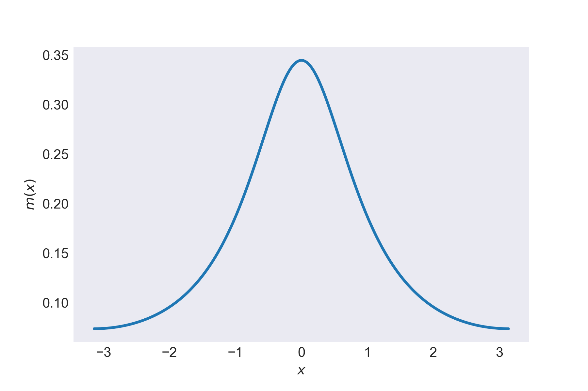
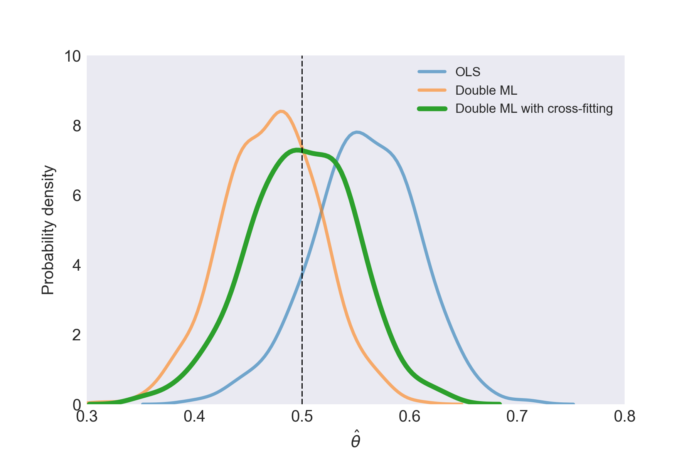

*The idea is that this will be the first in a series of posts covering econometrics in Python.*

At a conference a couple of years ago, I saw Victor Chernozhukov present his paper on [Double/Debiased Machine Learning for Treatment and Causal Parameters](https://arxiv.org/abs/1608.00060). It really stuck with me because of the way it fruitfully combines econometrics and machine learning. Machine learning is obsessed with prediction, and is getting [very good at it](https://blog.floydhub.com/Turning-design-mockups-into-code-with-deep-learning/). Econometrics is obsessed with causality and identification, and pretty good at it - especially in 'messy' real-world situations. Combining the two promises to provide powerful new ways to understand causal relationships.

So, in brief, what does 'double' machine learning do? It's one way to bring the power of machine learning for prediction on non-linear problems into an econometric context in which the asymptotic properties of the estimates of the parameters of interest are known to behave well. The problem is that just applying machine learning to predict outcomes ($Y$) from a treatment or variable ($D$) in the presence of many controls ($X$) will lead to biased estimates of the model parameter ($\theta$). The double machine learning method of Chernozhukov *et al.* delivers point estimators that have a $\sqrt{N}$ rate of convergence for $N$ observations and are approximately unbiased and normally distributed.

The clearest example, which I reproduce here from the paper, is of partially linear regression. They take it themselves from [Robinson (1988)](https://www.jstor.org/stable/1912705). The model is

$$
Y = D\cdot\theta + g(X) + U, \quad \quad \mathbb{E} \left[U | X, D \right] =0 \\
D = m(X) + V, \quad \quad \mathbb{E} \left[V | X\right] =0
$$

with $X = (X_1,X_2,\dots,X_p)$ a vector of controls. Here $\eta=(m,g)$ can be non-linear.

The naïve machine learning approach would be to estimate $D\cdot\hat{\theta} + \hat{g}(X)$ using one of the standard algorithms (random forest, support vector regression, etc). The authors of the paper show that doing this means that $\hat{\theta}$ effectively has a slower than root $N$ rate of convergence due to the bias in estimating $\hat{g}$.

They suggest overcoming this bias using orthogonalisation and splitting the sample. They obtain $\hat{V} = D - \hat{m}(X)$ using machine learning on an auxiliary sample; finding the mean of $D$ given $X$. With the remaining observations, they define an estimator for $\theta$, $\check{ \theta}$, which is a function of $\hat{V}$, $D$, $X$, and an estimate of $g$ given by $\hat{g}$. As they say (with a slight change in notation),

> By approximately orthogonalizing $D$ with respect to $X$ and approximately removing the direct effect of confounding by subtracting an estimate of $\hat{g}$, $\check{ \theta}$ removes the effect of regularization bias ... The formulation of $\check{ \theta}$ also provides direct links to both the classical econometric literature, as the estimator can clearly be interpreted as a linear instrumental variable (IV) estimator, ...

The double comes from estimating $\hat{V}$ in the auxiliary problem, as well as $\hat{g}$, before calculating the estimator $\check{\theta}$. In their paper, Chernozhukov *et al.* also discuss estimating average treatment effects, local average treatment effects, and average treatment effects for the treated using a more general formulation where $g$ is a function of both $X$ and $D$. More on the technical details and other applications can be found in the paper; here we'll look at an example estimation in the context of a model

### Double machine learning in practice

So how does it work in practice? With the sample split into two sets of size $n=N/2$ indexed by $i\in I$ and $i \in I^C$, there are four steps,

1. Estimate $\hat{V} = D - \hat{m}(X)$ using $I^C$
2. Estimate $Y = \hat{g}(X) + \hat{u}$ using $I^C$
3. Estimate $$\check{\theta}(I^C,I) = \left(\frac{1}{n}\displaystyle\sum_{i\in I}\hat{V}_i D_i\right)^{-1} \frac{1}{n} \displaystyle\sum_{i\in I} \hat{V}_i \left(Y_i-\hat{g}(X_i)\right)$$
4. Construct the efficient, cross-fitting estimate: $$\check{\theta}_{\text{cf}} = \frac{1}{2} \left[\check{\theta}\left(I^C,I\right)+\check{\theta}\left(I,I^C\right) \right]$$

### Simulated example

This example was inspired by this [great post](https://www.r-bloggers.com/cross-fitting-double-machine-learning-estimator/) by Gabriel Vasconcelos. To make it more exciting, I'll use a slightly different functional form with $g$ as sine squared and $m$ as the wrapped Cauchy distribution:

$$
g(x)= \sin^2(x) \\
m(x;\nu,\gamma)= \frac{1}{2\pi} \frac{\sinh(\gamma)}{\cosh(\gamma)-\cos(x-\nu)}
$$

Let's keep it simple and set $\nu=0$ and $\gamma=1$. The wrapped Cauchy looks like this:

*The wrapped Cauchy distribution*

Our model is

$$
y_i = d_i\theta + g(x_i'\cdot b) + u_i, \quad \quad  \\
d_i = m(x_i'\cdot b) + v_i \quad \quad
$$

$x_i$ has length $K=10$ and will be generated from a multivariate normal distribution, the true value of the causal parameter will be $\theta=0.5$, and $b_k=1/k$. The errors will be

$$
u_i, v_i \thicksim \mathcal{N}(0,1)
$$

and I'm going to use the [scikit learn](http://scikit-learn.org/stable/index.html) implementation of the [random forest regressor](https://en.wikipedia.org/wiki/Random_forest) to do the machine learning.

 Note that I'm using a scalar $D$ in the example below but, in the original paper, it's a binary treatment - thanks to [Kyle Carlson](https://twitter.com/KyleCSN) for pointing out that this could cause some confusion!

The code, using Python 3, is
```python
import numpy as np
from sklearn.datasets import make_spd_matrix
import math
import statsmodels.api as sm # for OLS
from sklearn.ensemble import RandomForestRegressor # Our ML algorithm
# Set up the environment
randomseednumber = 11022018
np.random.seed(randomseednumber)
N = 500 # No. obs
k=10 # = No. variables in x_i
theta=0.5 # Structural parameter
b= [1/k for k in range(1,11)] # x weights
sigma = make_spd_matrix(k,randomseednumber) #
# NUmber of simulations
MC_no = 500
def g(x):
    return np.power(np.sin(x),2)
def m(x,nu=0.,gamma=1.):
    return 0.5/math.pi*(np.sinh(gamma))/(np.cosh(gamma)-np.cos(x-nu))
# Array of estimated thetas to store results
theta_est = np.zeros(shape=[MC_no,3])

for i in range(MC_no):
    # Generate data: no. obs x no. variables in x_i
    X = np.random.multivariate_normal(np.ones(k),sigma,size=[N,])
    G = g(np.dot(X,b))
    M = m(np.dot(X,b))
    D = M+np.random.standard_normal(size=[500,])
    Y = np.dot(theta,D)+G+np.random.standard_normal(size=[500,])
    #
    # Now run the different methods
    #
    # OLS --------------------------------------------------
    OLS = sm.OLS(Y,D)
    results = OLS.fit()
    theta_est[i][0] = results.params[0]

    # Naive double machine Learning ------------------------
    naiveDMLg =RandomForestRegressor(max_depth=2)
    # Compute ghat
    naiveDMLg.fit(X,Y)
    Ghat = naiveDMLg.predict(X)
    naiveDMLm =RandomForestRegressor(max_depth=2)
    naiveDMLm.fit(X,D)
    Mhat = naiveDMLm.predict(X)
    # vhat as residual
    Vhat = D-Mhat
    theta_est[i][1] = np.mean(np.dot(Vhat,Y-Ghat))/np.mean(np.dot(Vhat,D))

    #  Cross-fitting DML -----------------------------------
    # Split the sample
    I = np.random.choice(N,np.int(N/2),replace=False)
    I_C = [x for x in np.arange(N) if x not in I]
    # Ghat for both
    Ghat_1 = RandomForestRegressor(max_depth=2).fit(X[I],Y[I]).predict(X[I_C])
    Ghat_2 = RandomForestRegressor(max_depth=2).fit(X[I_C],Y[I_C]).predict(X[I])
    # Mhat and vhat for both
    Mhat_1 = RandomForestRegressor(max_depth=2).fit(X[I],D[I]).predict(X[I_C])
    Mhat_2 = RandomForestRegressor(max_depth=2).fit(X[I_C],D[I_C]).predict(X[I])
    Vhat_1 = D[I_C]-Mhat_1
    Vhat_2 = D[I] - Mhat_2
    theta_1 = np.mean(np.dot(Vhat_1,(Y[I_C]-Ghat_1)))/np.mean(np.dot(Vhat_1,D[I_C]))
    theta_2 = np.mean(np.dot(Vhat_2,(Y[I]-Ghat_2)))/np.mean(np.dot(Vhat_2,D[I]))
    theta_est[i][2] = 0.5*(theta_1+theta_2)

```

Below is a plot of the kernel density estimates of $\theta$ using [seaborn](https://seaborn.pydata.org/). The peak of the distributions for OLS and double ML without cross-fitting are off the true value, but the cross-fitted double ML procedure gets much closer.

*The estimates of $\theta$*

So there it is: double machine learning is a useful technique at the intersection of machine learning and econometrics which can produce approximately unbiased and normally distributed point estimates in semi-parametric settings.
