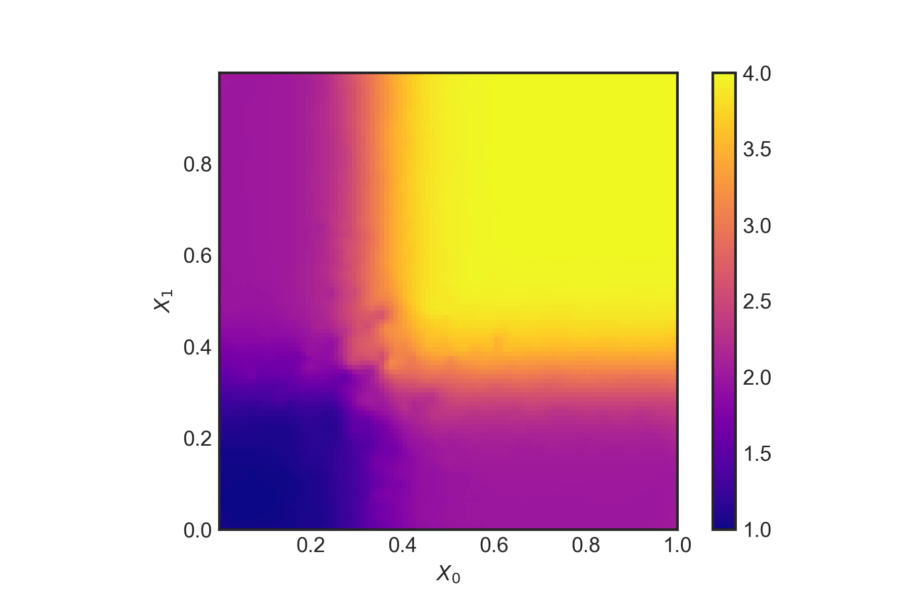

*The third in a series of posts covering econometrics in Python. Here I look at 'causal forests'.*

As I mentioned in a [previous post]({{site.baseurl}}/2018/02/10/econometrics-in-python-partI-ML/), there are methods at the intersection of machine learning and econometrics which are really exciting. [Susan Athey](https://www.gsb.stanford.edu/faculty-research/faculty/susan-athey) is very active in this space and has written a number of papers, including a review article of where the cross-over between economics and computer science is headed. In this post, I'm going to look at recreating an example from her paper, 'Estimation and inference of heterogeneous treatment effects using random forests' (Wager & Athey, 2017).

The paper is a recipe for doing non-parametric causal estimation of heterogeneous treatment effects. Imagine a natural experiment with people who are different according to a set of covariates $X_i$, and who are assigned a treatment $W_i \in \{0,1\}$. The response is $Y_i \in \mathbb{R}$, giving $(X_i,W_i,Y_i)$ for each observation. Then the treatment effect, given by

$$
\tau(x) = \mathbb{E}\left[Y^{(1)}-Y^{(0)} | X = x\right]
$$
can be estimated using a random forest, where the observed response $Y^{(h)}$ is labelled for either the treatment case ($h=1$) or the no treatment case ($h=0$).

 What is especially nice about Wager and Athey's approach is that it employs the power of classification and regression trees but provides point estimates of the treatment effect that are pointwise consistent and satisfy,

$$
\frac{\hat{\tau}(x) - \tau(x)}{\sqrt{\text{Var}(\hat{\tau}(x))}} \longrightarrow \mathcal{N}(0,1)
$$

that is, the error in the pointwise estimate is asymptotically Gaussian. There are some conditions and assumptions for their method to work. The main one is unconfoundedness, which is defined as

$$
\left\{Y_i^{(0)}, Y_i^{(1)} \right\} \perp W_i | X_i
$$

meaning that the response variables are independent of the assignment to the treatment or control group once the covariates are accounted for.

To show how this works, I will reproduce one of the simulation experiments from their paper. There is an R package which implements their method, but I couldn't find one in Python. There are some more comments on the approach at the end of the post.

### Simulation experiments

We will set $X \thicksim \mathcal{U} ([0 , 1]^d )$ for a $d$ dimensional space of covariates, and assume
$$
Y^{0/1} \thicksim \mathcal{N}(\mathbb{E}[Y^{0/1}|X],1)
$$
so that the noise in the response variable is homoskedastic. Further assumptions are that the mean effect, $m(x)$, and the treatment propensity, $e(x)$, are

$$
m(x) = 0.5 \mathbb{E}\left[Y^{(1)}+Y^{(0)} | X = x\right] = 0
$$


$$
e(x) = \mathbb{P}\left[W=1 | X = x\right] = 0.5
$$

The true data generating process will be

$$
\tau(x) = \xi(X_1)\xi(X_2); \quad \quad \xi(x)=\frac{1}{1+e^{-20(x-1/3)}} +1
$$

with the number of observations set to $n=5000$. To make this a tough test, we can set $d=6$ so that there are a few noisy covariates which don't influence the response variable but could confuse the regression trees (as only the first two dimensions are important).

Let's first generate the data using Python:

```python
import numpy as np
import statsmodels.formula.api as sm
import pandas as pd
import random
import matplotlib.pyplot as plt
from sklearn import tree
import scipy.interpolate
# No. dimensions of covariates
d = 6
# No. observations
n= 5000
# s set size
s = 2500
X = np.random.uniform(0,1,size=(n,d))
def xi(x):
    return (1+1./(1.+np.exp(-20.*(x-1./3.))))
tau = np.multiply(xi(X[:,0]),xi(X[:,1]))
```

we can take a look at the function $\xi(X)$,

```python
def tauxy(X_0,X_1):
    return np.multiply(xi(X_0),xi(X_1))
# Quick plot of tau as function of X_1, X_2 assuming continuous support
def plotFunc(func):
    X_0 = np.linspace(0, 1, 1000)
    X_1 = np.linspace(0, 1, 1000)
    X, Y = np.meshgrid(X_0, X_1)
    Z = func(X, Y)
    plt.style.use('seaborn-white')
    plt.imshow(Z, vmin=1., vmax=4., origin='lower',
              extent=[X_0.min(), X_0.max(), X_1.min(), X_1.max()],
             cmap='plasma')
    plt.colorbar()
    plt.xlabel(r"$X_0$")
    plt.ylabel(r"$X_1$")
plotFunc(tauxy)
```

*The true $\tau(x)$ as a function of $X_0$ and $X_1$*

### Double-sample causal trees
Now we apply the recipe from their paper:

1. Draw a random subsample of size $s$ from $\{1,\dots,n\}$ without replacement and divide into two disjoint sets $\mathcal{I}$ and $\mathcal{J}$ such that $\lvert\mathcal{J}\rvert = \lceil s/2 \rceil$ and $\lvert\mathcal{I}\rvert = \lfloor s/2 \rfloor$.
2. Grow a tree via recursive partitions and split using the $\mathcal{J}$ data but no $Y$ observations from the $\mathcal{I}$ sample. The splitting criteria to use for double-sample causal trees is the squared-error minimising split.
3. Estimate the leaf-wise response from the $\mathcal{I}$ sample observations.

The causal tree point estimates are given by

$$
\hat{\tau}(x) = \frac{1}{|\{i:W_i=1,X_i\in L\}|} \sum_{\{i:W_i=1,X_i\in L\}} Y_i - \frac{1}{|\{i:W_i=0,X_i\in L\}|} \sum_{\{i:W_i=0,X_i\in L\}} Y_i
$$
where $X_i \in L$ means that $L(x)$ is the leaf containing $x$. However, because our example is based on $\tau(x)$, we will learn directly on that.

The sampling is done as follows:

```python
# Draw a random subsample of size s.
# Choose s ints between 0 and n randomly
subSampleMask = random.sample(range(0, n), s)
# Create set I
setIMask = random.sample(subSampleMask, np.int(np.ceil(s/2.)))
setI = [X[setIMask]]
dfSetI = pd.DataFrame(data=X[setIMask])
# Create set J
setJMask = [i for i in subSampleMask if i not in setIMask]
setJ = [X[setJMask]]
```

The regression tree is trained on the $\mathcal{J}$ set using the ```sklearn``` decision tree with a mean-squared error criterion to determine the quality of the splits,

```python
# Create tree on the J set
clf = tree.DecisionTreeRegressor(criterion='mse')
clf = clf.fit(setJ[0], tau[setJMask])
```

Now we can produce the predictions for $\hat{\tau}(x)$ using the $\mathcal{I}$ set, and look at the out of sample $R^2$,

```python
tau_hat = clf.predict(dfSetI.iloc[:,:d])
# Out of sample R^2:
clf.score(dfSetI.iloc[:,:d],tau[setIMask])
```

    0.9981039884465186

A fairly strong out of sample score! Let's have a look at the out of sample test more closely by plotting it (with some linear interpolation),

```python
def plotResults(dfSetI,tau_hat):
    # Set up a regular grid of interpolation points
    xi, yi = np.linspace(dfSetI.iloc[:,0].min(),
                         dfSetI.iloc[:,0].max(), 100), np.linspace(dfSetI.iloc[:,1].min(), dfSetI.iloc[:,1].max(), 100)
    xi, yi = np.meshgrid(xi, yi)
    # Interpolate
    rbf = scipy.interpolate.Rbf(dfSetI.iloc[:,0], dfSetI.iloc[:,1], tau_hat, function='linear')
    zi = rbf(xi, yi)

    plt.imshow(zi, vmin=1., vmax=4., origin='lower',
               extent=[dfSetI.iloc[:,0].min(), dfSetI.iloc[:,0].max(), dfSetI.iloc[:,1].min(), dfSetI.iloc[:,1].max()],
              cmap='plasma')
    plt.colorbar()
    plt.show()
```


```python
plotResults(dfSetI,tau_hat)
```


*$\hat{\tau}(x)$ using the double-sample causal tree.*

This does seem to capture the treatment well given the two dimensions which matter - despite the 'noise' from the other four dimensions. The authors also outline a method for (essentially) bootstrapping which repeats the above process but with different samples. The final estimate is

$$
\hat{\tau} = B^{-1}\sum_{b=1}^B \hat{\tau}_b
$$

This is a really nice application of classification and regression trees to causal effects. However, I did find their paper a bit difficult to follow in places, especially on the splitting rules for causal trees versus regression trees. Specifically, in the example, it seems like mean squared prediction error *is* the right splitting criterion for the causal tree because the tree is being directly trained on the treatment, $\tau$. But in general, $\tau$ is not directly available and the splits of the tree must be chosen to as to maximise the variance of $\hat{\tau}(X_i)$ for $i\in\mathcal{J}$ instead.

**Wager, S., & Athey, S. (2017). Estimation and inference of heterogeneous treatment effects using random forests. Journal of the American Statistical Association.**
[Link to paper.](https://doi.org/10.1080/01621459.2017.1319839)
