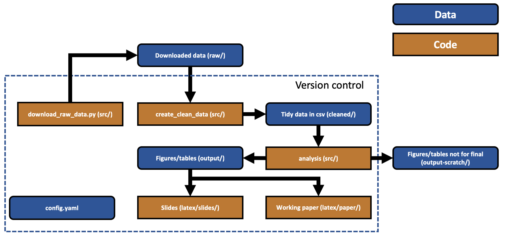

# Best practice for research project organisation

This monster blog post is going to discuss how to organise your a data science project or research project: data, code and outputs. I'll cover how to structure the project, version control, data and data storage, analytical tools, coding standards, and what to do when your project is over.

##### Caveats
Of course, these are just my opinions, they're far from exhaustive, and there may well be good reasons to set up your project differently depending on what it is that you're doing. I'm interested in hearing different perspectives so get in touch if you have them.

Inevitably the post is going to be geared toward Python because it's my primary language but much of the advice applies equally well to R. Similarly, although most of what I'm saying applies across platforms, in some in places it may be more relevant to Mac OS.

I'm not going to discuss topics like unit tests, automatic creation of documentation, or making the project into an installable package in this post and, for most small research projects, these features would probably be overkill.

For a more detailed perspective on best practice research project organisation, see [Good enough practices in scientific computing. PLoS computational biology, 13(6), e1005510](https://journals.plos.org/ploscompbiol/article?id=10.1371/journal.pcbi.1005510). A similar post from a more pure data science perspective may be [found here](https://www.kaggle.com/rtatman/reproducible-research-best-practices-jupytercon), and there's a [machine learning oriented cookiecutter project here](https://drivendata.github.io/cookiecutter-data-science/).

#### The example project

There's a [small research project github repository](https://github.com/aeturrell/cookie-cutter-research-project) that accompanies this post. To use it as the basis of your small research project, open up a command line and type ```git clone https://github.com/aeturrell/cookie-cutter-research-project.git``` in the directory in which you want to clone it, or download it directly from github.

It is in Python 3 and uses the ONS API to download some macroeconomic time series, process them into tidy data, and then use them within a dynamic factor model&dagger; inspired by [Chad Fulton](http://www.chadfulton.com/)'s tutorials/notebooks which you can find [here](http://www.chadfulton.com/fulton_statsmodels_2017/sections/6-out-of-the-box_models.html#dynamic-factors) and [here](https://www.statsmodels.org/dev/examples/notebooks/generated/statespace_dfm_coincident.html).

It is very much a toy example and not intended to be accurate or say anything at all about the real world! It is designed to showcase how the various components of what I'll say below fit together in practice.

Within the example project, there are Latex templates for both slides and a working paper. These are based on [Paul Goldsmith-Pinkham](https://twitter.com/paulgp?lang=en)'s excellent templates, the originals of which you can find [here for slides](https://github.com/paulgp/beamer-tips) and [here for the working paper](https://github.com/paulgp/draft-tex).

Okay, on to the main event...

## Table of Contents
1. [Project structure](#structure)
2. [Version control](#version-control)
3. [Data](#data)
4. [Analytical tools](#analytical-tools)
5. [Coding standards](#coding-standards)
6. [Writing the paper](#writing-the-paper)
7. [After the project](#after-the-project)


## Project structure

The structure of your project should be a directed acyclic graph with raw data making up the first nodes and research outputs (e.g. paper or slides) the final nodes. Here's an example for the cookiecutter research project:



Why this directed acyclic graph structure? For reproducibility, you can't have steps earlier on in the project that depend on steps later on in the process. This may seem completely obvious but, believe it or not, I have seen projects where later stage outputs are looped back to be inputs into earlier stages.

Another important principle here is to separate out different phases of the analysis. Sometimes this is about avoiding repeated effort - going from raw data to cleaned data might be very expensive in terms of time. 

Before you start your project, it's really worth taking the time to sketch out on paper how everything will fit together and which parts might depend on each other. Putting a lot of effort into this step will save you a lot of time in the long run. Armed with a clear structure, you will write better, more modular code that does not involve repetition. Of course, research work is inherently uncertain and you shouldn't be afraid to change up the structure if the focus or goals of the project change.

Give careful thought to file naming (e.g. scripts should typically say what they do, and data should say what it is). If there are natural groups of content within a directory (e.g. different types of raw data, or different stages in the analysis), create clearly named subdirectories rather than dumping everything in one huge and unwieldy folder.

Use relative paths rather than absolute – set up the code repository so a co-author or reviewer can pick up the entire directory structure, drop in a random place on a random machine and still run it. 

If you haven't tried putting figures and tables in a separate directory to your Latex code before then the example project implements an efficient way to do so. You set a single path and can then refer to outputs only by their name (not their full path). If you want to be even more fancy you can [move files around](http://www.jespertoftkristensen.com/JTK/Blog/Entries/2014/1/13_Organize_your_LaTeX_Project.html) during Latex compilation.

Perhaps you need to output your (Latex) writing to Microsoft's Word format or to markdown as part of your workflow? In that case, I'd suggest using [pandoc](https://pandoc.org/) but be warned that ensuring references, citations, equations, and inputs are included correctly can be fiddly.

One other important principle: friends do not let friends use whitespace in filenames or paths.

##### Configuration files

You'll notice that there is a config file, config.yaml, that sits above everything else. The purpose of this is to make adding global settings to your project easier, especially if they are directories. The advantage of this config file is that you can see what settings are being run from one place and, if you do need to change the structure of the project, you only have to do it in one place. Similarly, others on the project can clearly see when and how important settings were changed without trawling through lots of code.

In the example project, I've put settings for plots into the config.yaml where they can be conveniently loaded. These start with the ```- viz:``` heading in the file.

.yaml is not the only configuration file available and I don't have a very strong view as to which is best as they all have their pros and cons. I've used both .ini and .yaml, and both can work for a simple project. You can find more about the ins and outs of different config file formats [here](https://martin-thoma.com/configuration-files-in-python/) (with handy examples) and [here](https://hackersandslackers.com/simplify-your-python-projects-configuration/).

## Version control

There are many articles on why you should use version control if you're doing any sort of coding and I'm not going to go over the arguments here. I will link to [this primer](https://www.atlassian.com/git/tutorials/what-is-version-control) instead. Most people use [git](https://www.atlassian.com/git/tutorials/what-is-git) for version control (it's completely free). Git has a painful learning curve but there are just a handful of commands that you'll use most of the time, especially on smaller projects. And, if you do run into trouble, there's always [www.ohshitgit.com](https://www.ohshitgit.com). Note that git is the tool to manage version control while github, gitlab, and bitbucket are hosting services for git repositories.

Beyond the software development-type reasons for version control, there are benefits that are particular to research. Journals increasingly require code to be submitted alongside papers; version control encourages good code management that will make submitting your code much easier when the time comes. If you host your code on platforms such as [github](https://github.com/) and [gitlab](https://about.gitlab.com/), privately at first, and then publicly when you publish, you can significantly extend the impact of your work. Those same platforms enable collaboration on code, including Latex, with co-authors. Even better, you can use tools like [git-blame](https://www.atlassian.com/git/tutorials/inspecting-a-repository/git-blame) to understand who changed what and when - useful in all kinds of situations, not just blaming co-authors for that misplaced semi-colon.

<blockquote class="twitter-tweet" data-lang="en"><p lang="en" dir="ltr">who called it `git blame` and not `git whose-line-is-it-anyway`?</p>&mdash; Jessica🏳️‍🌈 (@ticky) <a href="https://twitter.com/ticky/status/1032028502961209344?ref_src=twsrc%5Etfw">August 21, 2018</a></blockquote>
<script async src="https://platform.twitter.com/widgets.js" charset="utf-8"></script>

The other great use of the various git platforms is to track bugs, to do lists, and even to host wikis.

A few extra tips on the interaction between version control and project structure.

Version control is not meant to track data, only code. However, for outputs, such as figures and tables, it's less clear where to draw the line. But (as shown above) I'd advise having a scratch-outputs folder that is not under version control that you can spam with hundreds of figures and tables and a (final) outputs folder that holds the tables and figures that are going to make it into the paper and/or slides.

Latex is code! Put it under version control. This also makes it easy to collaborate with co-authors, and work out who changed what when. Some prefer to use tools like [Overleaf](https://www.overleaf.com/), an online Latex editor with some WYSIWYG features, instead.

There are some folders, e.g. raw/, that you'd like to keep even though none of the *contents* of the folder should be under version control. There is a special file for that, called .gitkeep, which tells git you'd like to keep the folder. The file can be completely empty and, on Unix systems, you can create it with ```touch raw/.gitkeep``` in the command line.

Likewise, there is a lot of gunk generated by Latex compilation that you probably don't want to keep under version control. This is what the magic .gitignore file is for in the project structure. It specifies what types of file to ignore. The .gitignore file in the example project will automatically ignore Latex compilation files, everything in the raw/ and output-scratch/ folders, and anything generated indirectly by running Python code or Latex compilation.


## Data

I find it useful to think about the main possible classes of data in a research project as being raw, intermediate, cleaned, and output. 

As the example project is simple, we are going to skip intermediate data and go straight for clean data.

##### Raw data 
Raw data is just that. No matter how horrible a format it comes to you in (a 50 sheet Excel file with different formats on each sheet anyone?), you should preserve that. Don't mess with it, keep it to one side and derive other, better data from it. You'll need it later when you try and replicate your own work.

##### Intermediate data 
Intermediate data is the data you get once you've made some progress on getting whatever mess you started with into shape. Maybe you had 5 different spreadsheets and you've managed to clean each one and dump them into CSVs. Yes, they are still not tidy, or in the format you need for analysis, or merged. But you've made some progress, progress worth making into a distinct phase of your analysis.

Intermediate data can be very large, in which case you may want to consider the speed and efficiency of storing it. For the python library pandas, there's a [nice post here](https://towardsdatascience.com/the-best-format-to-save-pandas-data-414dca023e0d) looking at file sizes and loading/saving speeds. As noted, intermediate data should not be under version control. Data versioning does exist but I've not (yet) seen it used for research projects - see [pachyderm](https://github.com/pachyderm/pachyderm) for an example.

##### Cleaned data 
Cleaned data is what's used to do the analysis. It's data that's ready to go into a machine learning model or regression. If a colleague were working on a similar project, this is (hopefully) what you'd send them instead of the 50-sheet Excel monstrosity.

Cleaned data should be stored in tidy format, that is data in which each observation is a row, each variable is a column, and each type of observation unit forms a table. This figure shows a visual example of tidy data.


From [R for Data Science](https://r4ds.had.co.nz/tidy-data.html).

If you want to find out more about why it's good practice to store your data in tidy format then it's worth reading [Hadley Wickham's paper on it](https://www.jstatsoft.org/article/view/v059i10).

In the vast majority of cases, the best data file format for your project's cleaned data is CSV. Everyone can open it, no matter what analytical tool or operating system they are using. As a storage format, it's unlikely to change. Without going into the [mire of different encodings](http://kunststube.net/encoding/), save it as UTF-8 (note that this is not the default encoding in Windows). This is especially true of text heavy data. 

Of course, CSV is great for tabular data but won't work for many other kinds. For other cases, Stanford's library has put together a [useful list](https://library.stanford.edu/research/data-management-services/data-best-practices/best-practices-file-formats) of preferred file formats for archiving everything from geospatial data to films. 

Do not store your data in Excel file formats. Ever. Firstly, it's not an open format, it's proprietary, even if you can open it with many open source tools. But, more importantly, Excel can do bad things like [changing the underlying values in your dataset](http://www.win-vector.com/blog/2014/11/excel-spreadsheets-are-hard-to-get-right/) (dates and booleans), and it tempts other users to start slotting Excel code around the data. This is bad - best practice is to **separate** code and data. Code hidden in Excel cells is not very transparent or auditable.


Should you put your tidy, cleaned data under version control? Probably not. But if it's small and unlikely to change much, it can be quite convenient to do so.

##### Output data

These are the final figures and tables that tell the story in your analysis. As noted, it's convenient to put the ones that are going to make it into your paper and any presentations you give under version control, and have a scratch folder for the rest. This a folder that's for the many extra figures and tables that you'll create, and perhaps want to glance at, but won't hold on to.

For figures, most journals require that you use lossless formats such as PDF and EPS. .eps and .pdf are vector image formats, they work by representing the shapes and lines of the image and so can be reproduced any resolution. They are distinct from rasterised formats (.png, .jpg) that work by having pixels that reproduce the image but only at a specific resolution. For images made up of smooth shapes and colours, like most charts, vector formats are superior because they encode the information to show an image at any resolution. For complex images, such as photographs, jpg is usually better because there is a natural limit to the resolution you would ever need in such an image. As journals tend to prefer it, my general recommendation is to use .eps wherever possible and, if you do have real images, find out what format the journal prefers. Not only do .eps files look better, but for figures they tend to take up less space on disk versus the equivalent png or jpg file. Modern programming languages like R and Python can export to all of these formats.

For reasons that are not at all obvious, Powerpoint does not play nicely with vector images but Keynote (Mac OS) and Beamer/Latex (all operating systems) do.&Dagger;

What about tables? My current strategy is to export these directly to Latex as .tex files. It's not so easy to look at these without compiling them using Latex but it saves a lot of time when (automatically) incorporating them into your paper and presentations. Tables as tex files also take up little space on disk and can happily go under version control.*


## Analytical tools

By analytical tools, I really mean the combination of programming language and integrated development environment (IDE) that you use. The best practice here is to use the right tool for the job.

In addition to that, it's worth thinking about how accessible your code will be to others when you release it. Code written in a proprietary language that requires users to shell out some cash just to run it is inevitably less accessible than code written in open source languages.

Unless you're running very computationally intensive code that needs C++ or Fortran, you're likely to be using one of Python, R, Julia, or Matlab. If you're coming from the social sciences then perhaps you'll be using Stata or EViews. Some of these languages come bundled with, and are almost inseparable from, their IDEs.

As for which IDE to use, many heavy R users swear by RStudio and I know of many Python users who either prefer Spyder (which comes bundled with the Anaconda distribution of Python) or PyCharm (anecdotally this seems to be preferred by software dev types).

Recently, I've mostly been using Visual Studio Code. VS Code is an extendible text editor and IDE that is free and very impressive: I've used it to run code in Python, R, markdown, and Latex. I believe it also supports Octave (aka free Matlab) and Julia, but I haven't tested these. There's syntax highlighting for both Stata and Matlab and - if you already have Stata installed - you can run apparently run Stata code from VSCode! Support for Python is very good; you can switch between environments within the IDE, launch interactive consoles, and [remotely connect](https://marketplace.visualstudio.com/items?itemName=ms-vscode-remote.vscode-remote-extensionpack) to an instance of Python running elsewhere. Switching between Python/conda environments with the click of a button is revelatory. See [here for a full list of supported languages](https://code.visualstudio.com/docs/languages/overview).

Most additional features require the installation of packages that can be found via the [package search](https://marketplace.visualstudio.com/VSCode). Two essential  extensions are [git-lens](https://marketplace.visualstudio.com/items?itemName=eamodio.gitlens) and [Markdown preview enhanced](https://marketplace.visualstudio.com/items?itemName=shd101wyy.markdown-preview-enhanced).

## Coding standards

The validity of your research depends, to a frightening degree, on the quality of your code. There are ways to code better and minimise the risk of mistakes even for small research projects that don't look anything like a software development project. Most languages have some sort of style guide to help you. Following them will make your code easier to read, more consistent, and more manageable. 

For R, there doesn't seem to be a single agreed upon style, but I'm sure you could do much worse than follow Hadley Wickham's [R style guide](http://adv-r.had.co.nz/Style.html), itself based upon the Google R style guide, at least if you're using the ```tidyverse``` ecosystem.

For Python, there is [PEP8](https://www.python.org/dev/peps/pep-0008/). Yes, it's a bit of a monster. Rather than read through it, just install a linter extension in your favourite IDE (see [this guide](https://code.visualstudio.com/docs/python/linting) for VS Code) and your code will be automatically checked for most style breaches as you type. It's a bit daunting to turn this on at first but it encourages you to produce much cleaner code.

In Python, the naming convention for most items is lower case separated by underscores, e.g. ‘this_is_a_script.py’, also known as snake case. There are different naming conventions (shown below) but it doesn’t matter which is used, as long as it’s consistent.

[Allison Horst](https://twitter.com/allison_horst) made this great cartoon of the different conventions that are in use.


For research, it's worth having the extensions and robustness checks that reviewers might request in mind early on. You don't want to be faced with a request that's going to force you to do a huge re-write of your code. Better to try and anticipate reasonable variations on what you've done from the start, difficult though that may be.

Make your code as modular as possible, and never re-write the same code twice. If the same code is being re-run, stick it in a function. You will save time in the long run and having functions defined once and only once makes it easy to change in the future too. 

Code comments can be helpful. The best code actually has very *few* comments because what's happening is clear without them. When that high bar can't be reached, add comments to make it easier for a reader to understand what your code is doing. Most likely, that reader will be future you.

Perform code reviews. Give what you've done to a colleague and ask them to go through it line-by-line checking it works as intended. If they do this properly and don't find any mistakes or issues then I'd be very surprised. Return the favour to magically become a better coder yourself.

Choose clarity over optimisation, at least as a starting point. Computation is cheap, brain time is not. If you really need to optimise, do it later when you've figured out where it will count.

## Writing the paper

This is geared towards how people write papers in economics but there's plenty of good advice for other fields too.

Many of these notes are shameless copy and paste jobs from the writings of much more experienced researchers. Specifically, Keith Head's [The Introduction Formula](http://blogs.ubc.ca/khead/research/research-advice/formula), Marc Bellamere's [The Middle Bits Formula](http://marcfbellemare.com/wordpress/12797) for applied papers, Marc Bellamere's [The Conclusion Formula](http://marcfbellemare.com/wordpress/12060), [Advice on how to structure a paper](https://twitter.com/rskudesia/status/1120324415424585728?s=20) from a mysterious, but very helpful, reviewer 3 as received by Ravi Kudesia, and a [Checklist for before submission](https://eebatou.wordpress.com/2008/01/19/your-10-point-checklist-before-sending-off-that-manuscript/) from Mike Kaspari.

These notes are included in the latex file of the cookie cutter project, appearing in the relevant sections of the draft paper template.

### Overall contribution

Ask the following questions:
1. How does the manuscript change, challenge, or fundamentally advance knowledge of the concepts, relationships, models, or theories embedded in the literature on X? (X is the literature to which you want to contribute).
2. How does the manuscript cause us to think about X in a way that would not normally be anticipated from extrapolations of existing work, thereby advancing future work in an important and useful way?
In response to question 1, it can be useful to create a 3x4 matrix. On one side list (1) change, (2) challenge, and (3) fundamentally alter. On the other side, list (1) concepts, (2) relationships, (3) models, and (4) theories.

One way to rethink the structure and contribution of a paper is to ensure that these 10 points are well-covered:
- What is the focus?
- Why it is relevant?
- What is known/not known (and why it needs attention)?
- What is the burning question?
- How is the question addressed (theoretically/empirically)?
- What was done?
- What was found?
- What does it mean?
- What has been added to the discussion?
- Why should others care?

This approach will help develop the argument of a paper.

### Introduction

#### The Hook
Attract the reader's interest by telling them that this paper relates to something interesting. What makes a topic interesting? Some combination of the following attributes makes Y something worth looking at:

- Y matters: When Y rises or falls, people are hurt or helped.
- Y is puzzling: it defies easy explanation.
- Y is controversial: some argue one thing while other say another.
- Y is big (like the service sector) or common (like traffic jams).
Things to avoid: 
- The bait and switch: promising an interesting topic but delivering something else, in particular, something boring.
- ``all my friends are doing it'': presenting no other motivation for a topic than that other people have written papers on it.

#### The Question
Tell the reader what the paper does. Think of this as the point in a trial where having detailed the crime, you now identify a perpetrator and promise to provide a persuasive case. The reader should have an idea of a clean research question that will have a more or less satisfactory answer by the end of the paper. The question may take two paragraphs. At the end of the first (2nd paragraph of the paper) or possibly beginning of the second (3rd paragraph overall) you should probably have the ``This paper addresses the question'' sentence.

#### The Antecedents

Identify the prior work that is critical for understanding the contribution the paper will make. The key mistake to avoid here are discussing papers that are not essential parts of the intellectual narrative leading up to your own paper. Give credit where due but establish, in a non-insulting way, that the prior work is incomplete or otherwise deficient in some important way.

#### The Value-Add
Describe approximately 3 contributions this paper will make relative to the antecedents. This paragraph might be the most important one for convincing referees not to reject the paper. A big difference between it and the earlier "question" paragraph is that the contributions should make sense only in light of prior work whereas the basic research question of the paper should be understandable simply in terms of knowing the topic (from the hook paragraph). "Antecedents" and "Value-added" may be intertwined. They may also take up to 3 paragraphs.

#### The Road Map

I find this tedious but many referees insist on it. Outline the organisation of the paper. Avoid writing an outline so generic that it could apply to any. Instead customise the road map to the project and possibly mention pivotal "landmarks" (problems, solutions, results…) that will be seen along the way. But keep this section as short as possible if including it at all.

### The middle section of a paper
#### Theoretical Framework (for theory papers) 
Consider these points:
- Primitives - What are the preferences and/or technology like?
- Variables: What are the choice (i.e., theoretically endogenous) variables? What are the parameters (i.e., theoretically exogenous variables)?
- Assumptions: What assumptions are you making about preferences and/or technology? What assumptions are you making about the choice variables? What assumptions are you making about the parameters?
- Maximisation Problem: What are the agents you are studying maximizing? What is the Lagrangian?
- First-Order Conditions: Self-explanatory. In some cases where it is not obvious that you are solving for a maximum or a minimum, you’ll want to show the second-order conditions as well.
- Testable Prediction: State your main testable prediction. Generally, this should map one-to-one with the empirical framework.
- Proof: Prove your main testable prediction. Here, go for simplicity rather than elegance–why go for a proof by construction when a proof by contradiction will do just fine?
- Other Results and Proofs: There might be some side results you can both demonstrate in theory and test empirically. Generally, papers should do one thing.
#### Empirical Framework
Consider these points:
- Estimation Strategy - What equations will you estimate? How will you estimate them? How will you treat the standard errors? What is the hypothesis test of interest for your main testable prediction? This is why there should generally be a one-to-one mapping from the main testable prediction to the empirical framework. If your outcome variable or variable of interest needs to be constructed or estimated, this is where you'd discuss it.
- Identification Strategy: What would the ideal data set look like to study your question? How close are you to that ideal, and what prevents you from getting closer? Then, discuss in turn how your identification strategy deals or not with (i) unobserved heterogeneity, (ii) reverse causality or simultaneity, and (iii) measurement error. Also think about what a violation of the stable unit treatment value assumption looks like here (does one observation getting treated somehow affect the outcome of another observation?), and whether you can somehow test for it.
#### Data and Descriptive Statistics
Consider these points:
- Data: When was it collected? Where? Why? By whom? How was the sample selected? Who was interviewed, or how were the data collected? What is the sample size? How does it compare to the population of interest? Do you lose any observations? Why? Did you have to impute any values and, if so, how did you do it? Are any variables proxies for the real thing? What does each variable measure, exactly, or how was it constructed?
- Descriptive Statistics: This is simple enough. If you choose to describe the contents of your table of descriptive statistics, tell a story about them, don’t just write up a boring enumeration of means.
- Balance Tests: In cases where you’re looking at a dichotomous (or categorical) variable of interest, how do the treatment and comparison sub-samples differ along the mean of the variables discussed under the previous sub-section?
#### Results and Discussion
Consider these points:
- Preliminary (Nonparametric?) Results: An image is worth 1,000 words. If you can somehow plot the relationship of interest in a two-way scatter with a regression line fit through it, or using kernel density estimates for treatment and comparison, it helps people see for themselves that there is a difference in outcomes in response to your variable of interest.
- Core (Parametric) Results: This is your core test of your main testable prediction. Here, there is no need to go into a discussion of the sign of each significant control variable, unless such a discussion is somehow germane to your core testable prediction.
- Robustness Checks: These are variations on your preferred specification that show your result wasn’t just a fluke. They are as important as your core results. Do not neglect them. Slice and dice the data in as many ways as possible, sticking many of these results in an appendix, to show that the main testable predictions is supported by the data and that you haven’t cherry-picked your results. If you use an IV, this is where you’d entertain potential violations of the exclusion restrictions, and test for them one by one. Or maybe you can test for the mechanisms through which your variable of interest affects your outcome of interest.
- Extensions: This is where you could explore treatment heterogeneity, or split the sample.
- Limitations: No empirical result is perfect. How is internal validity limited? How is external validity limited? What are your results not saying, i.e., what mistakes might people make in interpreting them? Every study is flawed or makes simplifying assumptions; every study has a method or result that may be misinterpreted. A caveat paragraph depicts a thoughtful author who is after the truth, not someone who is trying to sell something.
#### Other comments for the middle section:
- No separate "literature review" section. Your literature review should be a one-paragraph affair in your introduction explaining how your work relates to the closest five to seven studies on the topic.
- You might want to have a section titled "Background" between the introduction and the theoretical framework. This is especially so when you study a legislative change, a new policy whose details are important or, in an IO paper, the features of the market you are studying. This can either be a substitute for or a complement to the theoretical framework.
- You might not need a theoretical framework. Some questions are old (e.g., the effects of land rights on agricultural productivity) and the theory behind them is well documented and does not need to be restated.
- The order between the "Empirical Framework" and "Data and Descriptive Statistics" sections can sometimes be switched. Go with what is logical.
- "limitations" are both under "Results and Discussion" and will also appear in the conclusion. It’s important for policy work not to have results that are misinterpreted.

### Conclusion
Some economics papers title their conclusion "Summary and Concluding Remarks" which is a good indication of how the conclusion should proceed. It should have two main parts: (i) a summary of what you have spent the several pages before the conclusion doing, and (ii) the way forward.
Consider covering these topics:
- Summary - "tell them what you’re going to tell them, tell them what you want to tell them, and tell them what you just told them." This part can be tedious, but it needs to be there, and it needs to be different enough (but not new) from the abstract and the introduction. If possible, tell a story.
- Limitations - The conclusion should emphasise the limitations of the approach. 
- Implications for Policy - Discuss what they are, but don’t make claims that are not supported by the results, and try to assess the cost of what is proposed in comparison to its benefits. You can do so somewhat imperfectly (this is where the phrase "back-of-the-envelope calculation" comes up the most often in economics papers), since the point of the work was presumably about only one side of that equation - usually the benefits of something, sometimes its costs, but rarely both. In two or three sentences, can you identify the clear winners and losers of a given policy implications? Its political feasibility? How easy or hard it would be to implement? This is the most sensitive section.
- Implications for Future Research - If you are writing a follow-up paper, this is a good place to set the stage for it.

### After the draft is written
- Get rid of every adjective modifying a relationship. Was x larger than y? Just say so. Saying it was much larger, or especially tiny, or amazingly huge adds no information.
- Replace long words with short words. Good writing maximizes the content of the message per number of letters used. Replace long words with short words of equal meaning. Replace utilisation with use.
- Replace every "differed" or "was different" with the actual, quantitative relationship. Compare the content per letters used for the following two sentences: "Plants fertilised with nitrogen differed in height from controls.", and "Plants fertilized with nitrogen were 2.5x taller than controls." Not only have you conveyed that nitrogen increased growth, you’ve given a vivid word picture as to how much.
- If your Discussion is more than 2x longer than your results, cut it down. Careful reviewers want to know how your results relate to your hypotheses, the strengths and weaknesses of your results, and perhaps one or two implications of your results. Focus on these three tasks.
- Market test your title and abstract. More and more editors are rejecting papers before they send them out for review. Reviewers typically accept or decline to review papers on the basis of the title and abstract. The title and abstract are the front door. They are the most important parts of the paper. Craft them carefully and show them to friendly reviewers.
- Spell check everything.
- Read it aloud. There is no better way to gauge the flow and logic of a manuscript. 


## After the project

##### Reproducibility

Unless you've been hiding under a rock, you'll know about the replicability crisis in research. Much of what I've outlined above should help make replication as easy as possible: you can ```git clone``` your repository into a new folder, add the raw data to the raw/ directory, and then hit go on the code. If the final outputs match up to what you did before, that's a good sign.

This is certainly not sufficient for replication in the broadest sense, but it is necessary. If even you can't reproduce your own results from scratch then you can't expect anyone else to be able to.

Technically, to make the project as reproducible as possible, you should be including information on how to set up the exact same environment (including package versions and operating system) that was used to generate the results. I do think this is going to be [essential in the future](https://www.natureindex.com/news-blog/a-petting-zoo-for-code-makes-studies-easier-to-reproduce) but, right now, it's just not practical for all but the most tech-savvy researchers. If you're using the same OS then conda's [environment files](https://docs.conda.io/projects/conda/en/latest/user-guide/tasks/manage-environments.html) are a step in the right direction when using Python, albeit an [imperfect one](https://stackoverflow.com/questions/39280638/how-to-share-conda-environments-across-platforms).

To create and use the conda environment included in the example project, use
```
conda env create -f ccenv.yml
```
on the command line, then activate the environment using ```conda activate ccenv```. 

To save an environment file from an existing conda environment, use ```conda env export > yourenv.yml```
but also use caution: this environment file will likely only work on your computer. It cannot easily be shared with others for them to recreate the same environment (it's tied to your OS for a start). One rough way around this that I've used in the cookiecutter project is to export the environment and then manually edit it to only retain i) Python and its version, and ii) packages that are explicitly imported in the code but with no version numbers. The idea is to ask for the version of Python that was used to generate the results initially but then let conda worry about the versions of the other imported packages, and any dependencies that those packages may have.


##### Data

Once you have finished your analysis, what do you do with the dataset you have painstakingly put together? Hopefully you'll make it ‘findable, accessible, interoperable and reusable’ (FAIR) so that others can use it, as recommended by the journals [*Nature*](https://www.natureindex.com/news-blog/what-scientists-need-to-know-about-fair-data) and *Scientific Data*.

Briefly, Findable equates to having meta-data (including a unique and persistent identifier) and being in a searchable index; Accessible means that data (and meta-data) are retrievable via open and free tools (proprietary formats like Stata .dta or Excel .xls files do not count, but open formats like .csv do) ; Interoperable means that data are in a widely used and machine readable structure such as [tidy](https://r4ds.had.co.nz/tidy-data.html); and Re-usable means including a data usage license and meta-data on provenance. There's a more detailed list of criteria [here](https://www.force11.org/group/fairgroup/fairprinciples).


Importantly, data should not just be appended to articles as a supplement but lodged in a searchable repository with an identifier that is citable. Use the Stanford library list earlier in the post for information on what file formats to use, and [this list](https://www.nature.com/sdata/policies/repositories) from *Scientific Data* of approved FAIR data repositories.

Incentives to publish data are perhaps not all that they could be currently, but [change is afoot](https://www.nature.com/articles/d41586-019-01715-4) and I would say that best practice is to share your data on one of these repositories whenever possible.

##### Code

When your project is ready to be released, opening it up to the outside world is as easy as clicking a button on github or gitlab. It will be easily searchable. To make life even easier for those finding it, make sure to have an informative readme file (with the citation information) in the main directory, to tag the project appropriately, and to add a user license. If you're unsure which license is appropriate, there is a [useful guide here](https://choosealicense.com/).

##### Credit

The assignment of due credit for research can cause great distress and [disagreement](https://www.nature.com/articles/d41586-018-05280-0). Among junior researchers, it can be career-making or -breaking. Senior researchers can be apt to believe that they alone are responsible for everything in a piece of work. I've heard plenty of anecdotal evidence of senior researchers inappropriately withholding credit, particularly in economics where there are typically very few authors per paper (see Figure 3 of [this paper](https://doi.org/10.1093/oxrep/grx051)).

I have a couple of recommendations to make assigning research credit fairer, more transparent, and less likely to cause problems or create misunderstandings.

First, if you are managing the project, make sure that everyone's expectations as to who will be an author are aligned right at the start.

Second, err on the side of being generous with co-authorship. The best outcome is that science progresses more quickly; if bringing aboard an extra person with particular skills helps to achieve that, then go for it. As a recent [Nature article](https://www.nature.com/articles/d41586-019-02084-8) put it, "By discouraging specialization, current authorship conventions weaken the scientific enterprise" and  "Science is a team sport". Do not worry that credit will be diluted. For me, the most exciting paper of the 21st century is the [Observation of Gravitational Waves from a Binary Black Hole Merger](https://doi.org/10.1103/PhysRevLett.116.061102). The author list runs to *3 pages*. 

To alleviate any concerns about diluting credit, you can always follow the physical sciences model of having authors listed in order of contribution (apart from the last author, who is typically the principal investigator). This is in contrast to the alphabetical ordering common in some other fields.

Finally, once the project is complete, be explicit about who did what by following the Contributor Roles Taxonomy, also known as [CRediT](https://www.casrai.org/credit.html). These breakdown scholarly contributions into 14 roles and three levels (lead, equal, and supporting), whether for authors or for those mentioned in the acknowledgements. Examples of roles include conceptualisation, funding acquisition, analysis, writing – original draft, and validation. To their credit, the originators of this system also propose to make the data on contributions machine readable and a number of journals are adopting it for submissions.


## Conclusion

I hope you've found this post informative. Disagree with anything or think I've missed an important point? Get in touch!

------
 
*You may find that because the .eps files used for figures are not in a sub-directory of the main .tex folder, you must add a flag to the Latex compiler. In TexShop, the steps are:
- Go to Preferences
- Go to Tab "Engine"
- Go to the field "pdfTeX"
- In the Latex Input Field add ``` --shell-escape``` at the end so that it changes from
```pdflatex --file-line-error --synctex=1```
to ```pdflatex --file-line-error --synctex=1 --shell-escape```
 

&Dagger; You can use .svg in the latest versions of Microsoft Powerpoint. Microsoft dropped support for .eps in Powerpoint due to concerns about security.

&dagger; If you're interested in the model, it has the following specification:

$$
\begin{aligned} \vec{y}_t & = \Gamma \vec{f}_t + \vec{u}_t \\\\ 
        \vec{f}_t & = A_1 \vec{f}_{t-1} + A_2\vec{f}_{t-2} + \Xi_t \quad \quad \Xi_t \thicksim \mathcal{N}(0,I)\\\\ 
	 \vec{u}_t  & = B_1 \vec{u}_{t-1} + B_2\vec{u}_{t-2} + \Phi_t \quad \quad \Phi_t \thicksim \mathcal{N}(0,\Sigma)
\end{aligned}
$$

where capital Greek and Latin characters represent matrices, arrows over characters denote vectors, and it is assumed that the different components of the `innovations' in the error updating equation are uncorrelated so that $ \Sigma $ is a diagonal matrix. The model has one unobserved factor that follows an AR(2), and the errors similarly follow an AR(2).
