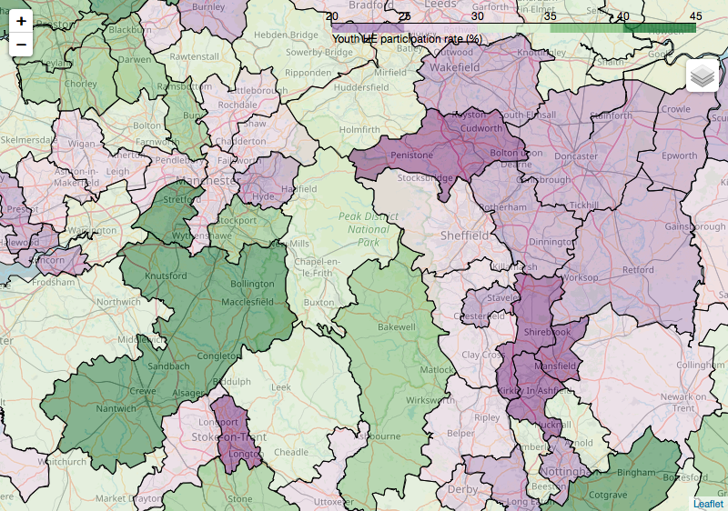

Given my work in both economics and Science, Technology, Engineering, and Mathematics (STEM), I've become interested in what factors determine groups' participation in higher education, what groups are being left out, and what might be done about it.

## Poverty means low participation

According to a [Social Mobility Commission](https://cdn.lkmco.org/wp-content/uploads/2016/12/Ethnicity-gender-and-social-mobility-Shaw-et-al.-2016.pdf) report from 2016, the most important determinant of whether someone goes to university at all or not is poverty, or, more precisely, whether someone receives free school meals. This applies across gender and ethnicity, though as the report notes "Disadvantaged young people from White British backgrounds are the least likely to access Higher Education". 

A lack of diversity in socio-economic background is perhaps less visible than some other troubling aspects of participation. But, if diversity matters at all, all dimensions of diversity matter.

Unfortunately, people from lower income/wealth backgrounds are some of the most difficult to influence with outreach campaigns as they tend to live in "remote rural or coastal areas and in former industrial areas, especially in the Midlands" according to the 2017 Social Mobility Commission's 'State of the nation' [report](https://www.gov.uk/government/publications/state-of-the-nation-2017). I'm from one of the parts of the UK specifically identified in this report, the High Peak, and it's unfortunately not all that surprising. Higher education institutions, and jobs which require advanced qualifications, are physically and psychologically at a distance. Other poorly ranked areas are similar: they include West Somerset (324 of 324), Thanet (274 of 324), and a cluster around West Norfolk.

There are detailed data on participation in higher education amongst young people available from the [Office for Students](https://www.officeforstudents.org.uk/). I've made a choropleth of these data below. The geographical areas with low participation are much the same as the problem areas identified in the report on social mobility. If you're not interested in where the data come from, skip the box below the figure.  


*Youth higher education participation rate by local authority district. Shown: Manchester and the Peak District.*

---

## Data on youth HE participation

The Office for Students provide [data](https://www.officeforstudents.org.uk/data-and-analysis/polar-participation-of-local-areas/polar4-data/) on the number of young people who participate in HE by middle super output areas. These are quite small areas so I've aggregated to local authority districts using a mapping which comes from data on [households in poverty](https://www.ons.gov.uk/file?uri=/employmentandlabourmarket/peopleinwork/earningsandworkinghours/datasets/householdsinpovertyestimatesformiddlelayersuperoutputareasinenglandandwales201112/current/householdsinpoverty201112.xls). I plotted these data with ```folium``` using [maps from the ONS Open Geography portal](http://geoportal.statistics.gov.uk/datasets/local-authority-districts-december-2016-ultra-generalised-clipped-boundaries-in-the-uk-wgs84). Minor gripe: no geojson format was available, so I had to make my own from the shapefiles.

---

## Science in the supermarket
Recently, I discussed how to reach those with the least HE participation with outreach superstar and Imperial College London colleague Dr. Stuart Higgins (whose award-winning podcast [Scientists Not The Science](http://www.scinotsci.com/) is worth checking out). As I understand it, the best advice - based on research - is that you need to show young students a path into higher education which could work for them; that it's feasible, that it's for people 'like them', and that they're good enough to make it.

I was talking to Stuart because of an amazing recent initiative he's been involved with called [Science in the Supermarket](http://www.superscience.org.uk/) which puts what he's learned into practice. Stuart and some other volunteers supported by Imperial College went to a supermarket in Somerset to engage young and old alike with science demos, and to tell them about careers in STEM. Although on a small scale, I think the brilliance of this initiative is that it avoids the self-selection problem which some other outreach programmes suffer from. I would love to see Economists in the Supermarket, or even Applied Mathematics in the Supermarket!

### Update 25/08/18

Stuart has [written up the results](http://www.superscience.org.uk/index.php/project-resources/#report) of the Science in the Supermarket project he ran so that others can learn from it. Laudably, by setting out everything from the project timetable, to the letters asking for volunteers, to the design of the meta-evaluation, to the costs, Stuart has made this intervention as reproducible as possible. Others can build upon what he has done. It's a more scientific way to run an  outreach programme.

Stuart gave me some informal pointers on 'what I would think about if starting another project' which I've made some minor tweaks to and reproduced below:
- Understand your own motivation and define a target; trying to approach a big problem can feel overwhelming and paralysing, starting with a specific, local goal can help
- Accept that balancing engagement with a day job is challenging
- Set a realistic scope for the project and accept that 'good enough' is good enough
- If possible, get both bottom-up (to help share the workload), and top-down support (to add legitimacy, open doors to resources, etc)
- Try and be evidence-based where possible


Another resource he mentioned is this [Aspires Report](https://www.kcl.ac.uk/sspp/departments/education/research/aspires/ASPIRES-final-report-December-2013.pdf) on 'Young people's science and career aspirations'. The two key findings I took away from it were that young people aren't necessarily aware of the careers which science can open up (economics!) and that 'science capital' is a strong predictor of aspiring to a career in science but that this capital is unevenly distributed across socio-economic groups.

Processing all of this, it seems like making STEM careers and/or STEM practitioners familiar to young people is one of the most useful outcomes outreach programmes can strive for.
