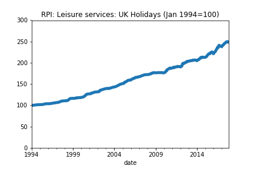

The [Office for National Statistics](https://www.ons.gov.uk/) (ONS) produces most of the macroeconomic statistics for the UK. I was delighted to discover recently that they had been working on an API.

There are so many good reasons for an ONS API to exist. They recently launched a new website and finding the data you want can be tricky - but a stable API can solve that. It also means that end-users of ONS data can make sure the latest releases go <em>directly</em> into their workflow. Previously, users would have had to download a separate file, usually an Excel file, and then do some cleaning on it. These files were not machine readable and took a while to clean before the data could be used. So the API is amazing and is going to make analysts' lives much easier.

You can find more about the ONS API on their dedicated [website](https://developer.ons.gov.uk/office-for-national-statistics-api/reference).

But if you just want to get started right away, here's a tiny bit of code which grabs a time series and puts it into a pandas dataframe ready for further processing:

```python
import requests
import os
import pandas as pd
import matplotlib.pyplot as plt


def grab_ONS_time_series_data(dataset_id,timeseries_id):
    """
    This function grabs specified time series from the ONS API.

    """
    api_endpoint = "https://api.ons.gov.uk/"
    api_params = {
    'dataset':dataset_id,
    'timeseries':timeseries_id}
    url = (api_endpoint
                        +'/'.join([x+'/'+y for x,y in zip(api_params.keys(),api_params.values())][::-1])
                        +'/data')
    return requests.get(url).json()

# Grab the data (put your time series codes here)
data = grab_ONS_time_series_data('MM23','CHMS')

# Check we have the right time series
title_text = data['description']['title']
print("Code output:\n")
print(title_text)
# Put the data into a dataframe and convert types
# Note that you'll need to change months if you're
# using data at a different frequency
df = pd.DataFrame(pd.io.json.json_normalize(data['months']))
# Put the data in a standard datetime format
df['date'] = pd.to_datetime(df['date'])
df['value'] = df['value'].astype(float)
df = df.set_index('date')
# Check the data look sensible
print(df.head())
# Plot the data
df['value'].plot(title=title_text,ylim=(0,df['value'].max()*1.2),lw=5.)
plt.show()

```

Here's the plot which comes out:



Pretty neat!
