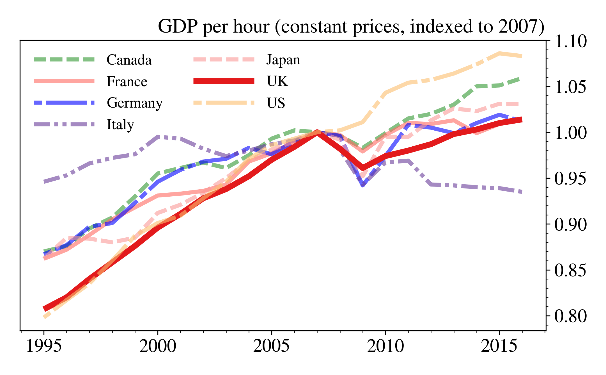

### Update 2021.03.06

I now recommend the style file below for quick, publication quality plots in Python using Matplotlib (tested on 3.3.4 and Python 3.8). To use the style, save it in a file called 'plot_style.txt' and load it in Matplotlib using:

```python
import matplotlib.pyplot as plt

plt.style.use('plot_style.txt')
```

before doing any plotting. The contents of 'plot_style.txt' are:

```text
xtick.color: 323034
ytick.color: 323034
text.color: 323034
lines.markeredgecolor: black
patch.facecolor        : bc80bd
patch.force_edgecolor  : True
patch.linewidth: 0.8
scatter.edgecolors: black
grid.color: b1afb5
axes.titlesize: 16
legend.title_fontsize: 12
xtick.labelsize: 12
ytick.labelsize: 12
axes.labelsize: 12
font.size: 10
axes.prop_cycle : (cycler('color', ['bc80bd' ,'fb8072', 'b3de69','fdb462','fccde5','8dd3c7','ffed6f','bebada','80b1d3', 'ccebc5', 'd9d9d9']))
mathtext.fontset: stix
font.family: STIXGeneral
lines.linewidth: 2
legend.frameon: True
legend.framealpha: 0.8
legend.fontsize: 10
legend.edgecolor: 0.9
legend.borderpad: 0.2
legend.columnspacing: 1.5
legend.labelspacing:  0.4
text.usetex: False
axes.titlelocation: left
axes.formatter.use_mathtext: True
axes.autolimit_mode: round_numbers
axes.labelpad: 3
axes.formatter.limits: -4, 4
axes.labelcolor: black
axes.edgecolor: black
axes.linewidth: 0.6
axes.spines.right : False
axes.spines.top : False
axes.grid: False
figure.titlesize: 18
figure.dpi: 300
```

Note that if you're using the plots for the web then you're likely to want to turn down the `figure.dpi` setting; 125 is a good compromise.

You can find more information on plotting in Python in my online book: see the [Intro to Data Visualisation](https://aeturrell.github.io/coding-for-economists/vis-intro.html) page for an overview of libraries and the basics of using them or, for lots of examples of standard charts, the [Common Plots](https://aeturrell.github.io/coding-for-economists/vis-common-plots.html) page.

If you're looking for easier customisation of plots in Matplotlib, try out the [**themepy**](https://github.com/petermckeeverPerform/themepy) package.

### Original post

High level languages like Python and R are great partly because entire workflows can be done within them; from data ingestion, to cleaning, to analysis, to producing plots and regression tables. But when I looked around online, I found that there wasn't a huge amount of information on how to do one of the last stages - producing plots - in a way that is consistent with what is required by journals.

Journals often ask for figures in lossless formats (think pdf, tiff, svg, and eps as opposed to png or jpg), in certain sizes, and at a specific or minimum resolution. What is most important in a journal article or working paper is clearly the content. However, when a paper looks good, and its figures are crisp, clear, and communicate a message, it helps to deliver the content in the way intended. Low resolution, rasterised images just look bad (at best) and distract from the point of the figure (at worst).

If you're not convinced of the benefits of lossless formats over rasterised ones, try creating a pdf with more than five or six very high resolution but simple (= not too many features) plots embedded as pngs using latex. Yes, it's big! For simple plots, lossless formats take up far less space on disk *and* they look better.

As an author, making plots easily digestible and a part of the narrative of the paper can enhance the experience for the reader substantially. Different colours, types of line, and levels of transparency can help here. For consistency, you may want to include the same mathematical symbols in the main text as you do in the legend using latex.

I often want to do all of the above, so I've put together an example. While much will need to be changed for other examples, it's a good starting point.

Let's begin with some parameter settings. Matplotlib, the Python plotting library, has a style file with defaults in. I'm going to change a few of these. They're mostly obvious.

```text
xtick.labelsize: 16
ytick.labelsize: 16
font.size: 15
figure.autolayout: True
figure.figsize: 7.2,4.45
axes.titlesize : 16
axes.labelsize : 17
lines.linewidth : 2
lines.markersize : 6
legend.fontsize: 13
mathtext.fontset: stix
font.family: STIXGeneral
```

The first real choice is about the relative size of the figure, and the font sizes of the plot title, axes titles, and label sizes. The journal *Nature* requires that [double-column figures be 183 mm wide](https://www.nature.com/nature/for-authors/final-submission), which is 7.2 inches using the units which Matplotlib works in. Heights can differ, but I choose an eye-pleasing 1.6 ratio. The only other really important choice here is what fonts to use. I've gone for Stix as it can be used for both latex and normal fonts, and it looks professional in plots. To use these settings, they just need to go in a plain text file called 'PaperDoubleFig.mplstyle' which we can point Matplotlib at later.

### The data

The data for the example are from the [Office for National Statistics](https://www.ons.gov.uk/) (ONS) website and are international comparisons of productivity. You can find the [raw data here](https://www.ons.gov.uk/economy/economicoutputandproductivity/productivitymeasures/bulletins/internationalcomparisonsofproductivityfinalestimates/2015), and I'm using the data behind their Figure 4. Although the page has an interactive feature, a hover which tells you the values in cross-section, the plot is hard to read if (as the article presumes) you're interested mostly in the UK relative to the other countries. We'll fix that later. Personally, I'm not a fan of the horizontal guide lines so I'll be omitting those too.

### The code

Let's see some code! Import the required libraries, and load up the style file for Matplotlib:

```python
import os
import numpy as np
import pandas as pd
import matplotlib.pyplot as plt
from matplotlib.ticker import ScalarFormatter,AutoMinorLocator
import matplotlib as mpl
#===========================================================
# Directory and filename; style file open
#===========================================================
# Change to the directory which contains the current script
dirFile = os.path.dirname(os.path.join('YourDirHere',
                          'NicePlotProductivity.py'))
# Load style file
plt.style.use(os.path.join(dirFile, 'PaperDoubleFig.mplstyle'))
# Make some style choices for plotting
colourWheel =['#329932',
            '#ff6961',
            'b',
            '#6a3d9a',
            '#fb9a99',
            '#e31a1c',
            '#fdbf6f',
            '#ff7f00',
            '#cab2d6',
            '#6a3d9a',
            '#ffff99',
            '#b15928',
            '#67001f',
            '#b2182b',
            '#d6604d',
            '#f4a582',
            '#fddbc7',
            '#f7f7f7',
            '#d1e5f0',
            '#92c5de',
            '#4393c3',
            '#2166ac',
            '#053061']
dashesStyles = [[3,1],
            [1000,1],
            [2,1,10,1],
            [4, 1, 1, 1, 1, 1]]
# Point to the data
fileName = 'rftxlicp1017unlinked.xls'
```

You'll notice that I've also defined `colourWheel` and `dashesStyles`. These are for plotting, and encode different colours and line dashes respectively. Each line in the time series plot will be differentiated by iterating over both. The colours originally come from [colour brewer](http://colorbrewer2.org/#type=sequential&scheme=BuGn&n=3), with a few additions and changes. There are more colours than are needed, but this set of colours can be used in other plots, or for qualitative choropleths.

Next, read in the data and process it. Here's one I made earlier:

```python
#===========================================================
# Read in and prep the data
#===========================================================
df = pd.read_excel(os.path.join(dirFile,fileName),
                  sheetname='Table 4')
df = df.iloc[3:,:]
df = df.rename(columns=dict(zip(df.columns,df.iloc[0,:])))
df = df.iloc[2:,:]
df = df.rename(columns={np.nan:'Year'}).set_index('Year')
df = df.dropna()
# Take a look to make sure this has worked nicely
df.head()
```

which produces:

| | Canada | France | Germany | Italy | Japan | UK   | US   | G7   | G7 exc. UK |
|--------|--------|---------|-------|-------|------|------|------|------------|------|
| Year   |        |         |       |       |      |      |      |            |      |
| 1995   | 87     | 86.2    | 86.7  | 94.6  | 86.2 | 80.7 | 79.8 | 83         | 83.2 |
| 1996   | 87.6   | 87.2    | 87.7  | 95.3  | 88.5 | 82   | 81.7 | 84.6       | 84.8 |
| 1997   | 89.5   | 88.8    | 89.7  | 96.6  | 88.4 | 84   | 83.5 | 86.1       | 86.3 |
| 1998   | 90.7   | 90.5    | 90.1  | 97.2  | 88   | 85.8 | 86   | 87.7       | 87.8 |
| 1999   | 93     | 91.8    | 92.3  | 97.6  | 88.5 | 87.6 | 88.7 | 89.7       | 89.8 |

so it looks like everything has been processed correctly. Now onto the plotting:

```python
plt.close('all')
fig, ax = plt.subplots()
for j,series in enumerate(df.columns[:-2]):
    if(series=='UK'):
        alphaVal = 1.
        linethick=5
    else:
        alphaVal = 0.6
        linethick = 3.5
    ax.plot(df[series].index,
                df[series]/100.,
                color=colourWheel[j%len(colourWheel)],
                linestyle = '-',
                dashes=dashesStyles[j%len(dashesStyles)],
                lw=linethick,
                label=series,
                alpha=alphaVal)
ax.set_xlabel('')
ax.yaxis.set_major_formatter(ScalarFormatter())
ax.yaxis.major.formatter._useMathText = True
ax.yaxis.set_minor_locator(  AutoMinorLocator(5))
ax.xaxis.set_minor_locator(  AutoMinorLocator(5))
ax.yaxis.set_label_coords(0.63,1.01)
ax.yaxis.tick_right()
nameOfPlot = 'GDP per hour (constant prices, indexed to 2007)'
plt.ylabel(nameOfPlot,rotation=0)
ax.legend(frameon=False, loc='upper left',ncol=2,handlelength=4)
plt.savefig(os.path.join(dirFile,'ProdCountries.pdf'),dpi=300)
plt.show()
```

Here's the plot which comes out, necessarily rendered here as a png but saved as a pdf if you use the code above:



The code looks more complicated than just using `df.plot()` but we get a lot for that extra complexity, including: the UK productivity time series being emphasised relative to those of the other countries, each country having a unique combination of colour and dash, the number of tick marks being sensible, only individual countries being plotted (`df.columns[:-2]` omits the two G7 related columns), and the y-axis ticks labels appearing on the right-hand side (which I think looks better for time series plots). Note that I've specified dpi=300 to set the resolution to what is often the *minimum* for journal submission.

I mentioned latex in the post title. Assuming you have the full [Miktex distribution](https://miktex.org/) installed (for example), then adding in latex is as easy as putting it into the title or label strings so that

```text
r"$\frac{\phi}{\zeta}$"
```

gives

$$\frac{\phi}{\zeta}$$

in the figure. This will render just like the other text in the figure.

No doubt there is a better way of packaging some of this up for use in other examples. As an alternative, [Seaborn](https://seaborn.pydata.org/) is a fantastic tool for quick, easy, good-looking data visualisation in Python but for journal articles, a straighter, plainer style like this may be more appropriate.
