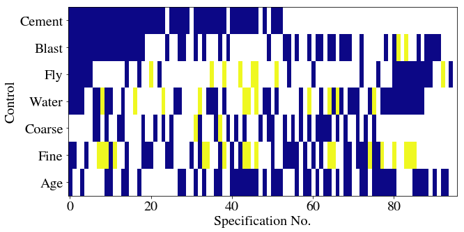
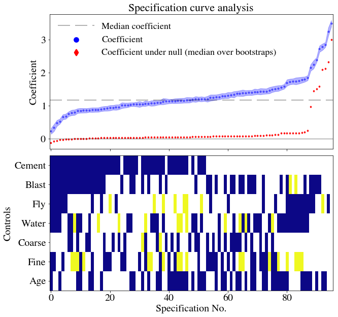

## Econometrics in Python Series - Part V

### Update 2021.03.10

Since publishing this post, I have written the [**specification_curve**](https://specification-curve.readthedocs.io/en/latest/readme.html) package for Python. **specification_curve** automates some aspects of specification curve analysis, namely running multiple regressions and displaying their results, but you can find out more info via the link.

### Original post

When specifying a causal model, modellers have a number of options. These can be informed by field intelligence, priors, and even misguided attempts to find a significant result. Even with the best of intentions, research teams can reach entirely different conclusions using the same, or similar, data because of different choices made in preparing data or in modelling it.

Typically this happens when there isn't a clear way to do 'feature engineering' on the data. For example, you have a high frequency time series which needs to be aggregated to a lower frequency: you could take the maximum, the minimum, or the average over each high frequency time period. A different choice may be appropriate in different settings.

There's formal evidence that researchers really do make different decisions; this [study](https://doi.org/10.1177/2515245917747646) gave the same research question - whether soccer referees are more likely to give red cards to dark-skin-toned players than to light-skin-toned players - to 29 different teams. From the abstract of that paper:

> Analytic approaches varied widely across the teams, and the estimated effect sizes ranged from 0.89 to 2.93 (Mdn = 1.31) in odds-ratio units. Twenty teams (69%) found a statistically significant positive effect, and 9 teams (31%) did not observe a significant relationship. Overall, the 29 different analyses used 21 unique combinations of covariates. Neither analysts’ prior beliefs about the effect of interest nor their level of expertise readily explained the variation in the outcomes of the analyses. Peer ratings of the quality of the analyses also did not account for the variability. 

So not only were different decisions made, there seems to be no clearly identifiable reason for them (although, getting a bit meta, perhaps other authors would have analysed this question differently!) 

There is usually scope for reasonable alternative model specifications when estimating causal coefficients, and those coefficients will vary with those specifications. Let's abuse notation and call this property

$$
\frac{\text{d} \beta}{\text{d} \text{ specification}}
$$

where $\beta$ is the coefficient of interest.

What can we do to ensure conclusions are robust to model specification change when that change is due to equally valid feature engineering-type choices? The art is all in deciding what is meant by, or what is a valid form for, $\text{d} \text{ specification}$ and showing that, even under different specifications, the estimates of $\beta$ are robust.

It's standard in economics to include many different model specifications in order to demonstrate robustness to different specifications. For the same target variable in the same context, there might be five or six of these alternative specifications. The picture below, from Autor, Dorn, and Hanson's paper [China Syndrome](http://economics.mit.edu/files/11602), gives a flavour.


Table 3 of 'China Syndrome'

But there may be times when it's appropriate to show many different specifications, for example in a contested area, or an area in which the feature choices are very unclear.

## Enter specification curve analysis

One way to more comprehensively analyse $\frac{\text{d} \beta}{\text{d} \text{specification}}$ is *specification curve analysis*.

Specification curve analysis as introduced in this [paper](http://sticerd.lse.ac.uk/seminarpapers/psyc16022016.pdf) looks for a more exhaustive way of trying out alternative specifications. from the paper, the three steps of specification curve analysis are:

1. identifying the set of theoretically justified, statistically valid, and non-redundant analytic specifications;
2. displaying alternative results graphically, allowing the identification of decisions producing different results; and
3. conducting statistical tests to determine whether as a whole results are inconsistent with the null hypothesis.

For a good example of specification curve analysis in action, see this recent [Nature Human Behaviour paper](https://doi.org/10.1038/s41562-018-0506-1) on the association between adolescent well-being and the use of digital technology.

## An example in Python

This example is going to use the concrete data I've [used previously]({{site.baseurl}}/2018/05/05/running-many-regressions-alongside-pandas/) to look at the effect of 'superplasticizer' on the compressive strength of concrete. I'm going to skip over step 1 quickly, as it will vary a lot depending on your dataset.

### Step 1

The data don't actually require any feature engineering, so we'll have to pretend that - beyond those two key variables - we're not sure whether other features should be included or not.

Actually, let's make it a *bit* more interesting and say that 'coarse' and 'fly' are actually based on the same raw data, they are just engineered differently in the data for analysis. Therefore we do not include them together in the model at the same time. That really covers step 1.

### Step 2

For step 2, displaying alternative results graphically, we need the data and the code.

First, let's set up the environment, then read in the data:

```{{python}}
import pandas as pd
import statsmodels.api as sm
import numpy as np
import matplotlib.pyplot as plt
from collections import Counter
from itertools import combinations
import matplotlib as mpl
import sklearn
jsonPlotSettings = {'xtick.labelsize': 16,
'ytick.labelsize': 20,
'xtick.labelsize':20,
'font.size': 22,
'figure.figsize': (10,5),
'axes.titlesize' : 22,
'axes.labelsize': 20,
'lines.linewidth': 2,
'lines.markersize' : 6,
'legend.fontsize': 18,
'mathtext.fontset': 'stix',
'font.family': 'STIXGeneral'}
plt.style.use(jsonPlotSettings)
```

```{{python}}
df = pd.read_excel('../../ManyRegsPandas/Concrete_Data.xls')
df = df.rename(columns=dict(zip(df.columns,[x.split()[0] for x in df.columns])))
print(df.head())
```

       Cement  Blast  Fly  Water  Superplasticizer  Coarse   Fine  Age   Concrete
    0   540.0    0.0  0.0  162.0               2.5  1040.0  676.0   28  79.986111
    1   540.0    0.0  0.0  162.0               2.5  1055.0  676.0   28  61.887366
    2   332.5  142.5  0.0  228.0               0.0   932.0  594.0  270  40.269535
    3   332.5  142.5  0.0  228.0               0.0   932.0  594.0  365  41.052780
    4   198.6  132.4  0.0  192.0               0.0   978.4  825.5  360  44.296075


This is the pure question - what dependence does concrete strength have on the use of superplasticizer?


```{{python}}
results = sm.OLS(df['Concrete'], df['Superplasticizer']).fit()
print(results.summary())
```

                                OLS Regression Results                            
    ==============================================================================
    Dep. Variable:               Concrete   R-squared:                       0.578
    Model:                            OLS   Adj. R-squared:                  0.578
    Method:                 Least Squares   F-statistic:                     1410.
    Date:                Fri, 25 Jan 2019   Prob (F-statistic):          5.29e-195
    Time:                        xx:xx:xx   Log-Likelihood:                -4804.2
    No. Observations:                1030   AIC:                             9610.
    Df Residuals:                    1029   BIC:                             9615.
    Df Model:                           1                                         
    Covariance Type:            nonrobust                                         
    ====================================================================================
                           coef    std err          t      P>|t|      [0.025      0.975]
    ------------------------------------------------------------------------------------
    Superplasticizer     3.4897      0.093     37.544      0.000       3.307       3.672
    ==============================================================================
    Omnibus:                       20.707   Durbin-Watson:                   0.639
    Prob(Omnibus):                  0.000   Jarque-Bera (JB):               22.783
    Skew:                          -0.298   Prob(JB):                     1.13e-05
    Kurtosis:                       3.420   Cond. No.                         1.00
    ==============================================================================
    
    Warnings:
    [1] Standard Errors assume that the covariance matrix of the errors is correctly specified.

That's the baseline regression, with $\beta = 3.4897$. Now we need to try the alternative specifications.

We have 7 potential control variables. It's worth bearing in mind what the upper limit on the number of specifications you could potentially run could be, for computational reasons. Each combination is going to be $n$ choose $k$, or

$$
\frac{n!}{k!(n-k)!}
$$

We want to look at all possible values of $k$, which is

$$
\sum_{0\leq k \leq n} \textstyle {\frac {n!}{k!(n-k)!}} = 2^n
$$

So this is not feasible as $n$ gets very large, but should be okay here.

In this case, there are also some mutually exclusive combinations which will reduce the overall number - remember I decided that 'coarse' and 'fly' are different ways of creating the same variable. Let's create all possible $2^7 = 128$ combinations first. We can use the Python combinations function to do this.


```{{python}}
# A list of the controls
controls = [x for x in df.columns if x not in ['Concrete','Superplasticizer']]
# Generate all combinations in a list of tuples
Allcomb = [combinations(controls, k) for k in range(len(controls)+1)]
# Flatten this into a single list of tuples
Allcomb = [item for sublist in Allcomb for item in sublist]
# Turn all the tuples into lists
Allcomb = [list(x) for x in Allcomb]
```

Let's have a look at some of these; the first 5, a random sample of 5, the last 1, and the total number

```{{python}}
print(Allcomb[:5])
for i in np.random.choice(Allcomb,5):
    print(i)
print(Allcomb[-1])
print(len(Allcomb))
```

    [[], ['Cement'], ['Blast'], ['Fly'], ['Water']]
    ['Fly', 'Water', 'Coarse', 'Age']
    ['Cement', 'Water', 'Fine']
    ['Blast', 'Fly', 'Coarse', 'Fine', 'Age']
    ['Cement', 'Blast', 'Coarse', 'Age']
    ['Blast', 'Water', 'Coarse']
    ['Cement', 'Blast', 'Fly', 'Water', 'Coarse', 'Fine', 'Age']
    128

Note that the original specification is included here as [], i.e. no control. We now need to remove the mutually exclusive combinations - that is any combination which has both 'Coarse' and 'Fly' in it. Then we'll look at the last entry to see if it has worked.

```{{python}}
Allcomb = [y for y in Allcomb if y not in [x for x in Allcomb if ('Coarse' in x) and ('Fly' in x)]]
Allcomb[-1]
```


    ['Cement', 'Blast', 'Water', 'Coarse', 'Fine', 'Age']


Great - the old last combination, which mixed features, has been dropped. Now we need to iterate over all possible regression specifications and store the coefficient calculated in each one.


```{{python}}
AllResults = [sm.OLS(df['Concrete'],
                      df[['Superplasticizer']+x]).fit() for x in Allcomb]
```

You can see this has run all of the possible combinations; here are the regression results for the last entry:


```{{python}}
AllResults[-1].params
```


    Superplasticizer    0.840783
    Cement              0.085463
    Blast               0.064191
    Water              -0.119120
    Coarse              0.016815
    Fine                0.002805
    Age                 0.106915
    dtype: float64

Great. Let's store the results in a dataframe. As well as the coefficient on superplasticizer, I'll store the standard errors, 'bse', and the pvalues for the independent variables. I'll then reorder everything by coefficient value.


```{{python}}
# Get coefficient values and specifications
df_r = pd.DataFrame([x.params['Superplasticizer'] for x in AllResults],columns=['Coefficient'])
df_r['Specification'] = Allcomb
# Get std err and pvalues
df_r['bse'] = [x.bse['Superplasticizer'] for x in AllResults]
df_r['pvalues'] = [x.pvalues for x in AllResults]
df_r['pvalues'] = df_r['pvalues'].apply(lambda x: dict(x))
# Re-order by coefficient
df_r = df_r.sort_values('Coefficient')
df_r = df_r.reset_index().drop('index',axis=1)
df_r.index.names = ['Specification No.']
print(df_r.sample(10))
```

                       Coefficient                 Specification       bse  
    Specification No.                                                        
    31                    1.044216  [Cement, Blast, Coarse, Age]  0.059440   
    27                    1.034839   [Cement, Blast, Water, Age]  0.058165   
    58                    1.290024                   [Fine, Age]  0.079633   
    62                    1.336140  [Blast, Water, Coarse, Fine]  0.095310   
    45                    1.154499            [Cement, Fly, Age]  0.072391   
    19                    0.912858                [Cement, Fine]  0.072651   
    55                    1.243370                [Coarse, Fine]  0.086451   
    50                    1.196307   [Cement, Coarse, Fine, Age]  0.067479   
    25                    1.008358        [Cement, Coarse, Fine]  0.074518   
    93                    2.842257                         [Age]  0.073861   
    
                                                                 pvalues  
    Specification No.                                                     
    31                 {'Superplasticizer': 1.3490880141286832e-60, '...  
    27                 {'Superplasticizer': 6.447248960284443e-62, 'C...  
    58                 {'Superplasticizer': 9.824299541334832e-53, 'F...  
    62                 {'Superplasticizer': 5.604831921131288e-41, 'B...  
    45                 {'Superplasticizer': 2.5456524931721465e-51, '...  
    19                 {'Superplasticizer': 8.7290431310275e-34, 'Cem...  
    55                 {'Superplasticizer': 7.235976198602693e-43, 'C...  
    50                 {'Superplasticizer': 1.5168657130127636e-61, '...  
    25                 {'Superplasticizer': 1.6517230301301733e-38, '...  
    93                 {'Superplasticizer': 2.233901784516485e-201, '...  


Now I will plot the results for the coefficient as a function of the different specifications, adding the standard errors as a swathe.


```{{python}}
plt.close('all')
fig, ax = plt.subplots()
ax.scatter(df_r.index,df_r['Coefficient'],lw=3.,label='',s=0.4,color='b')
ax.set_xlabel(df_r.index.name)
ax.set_ylabel('Coefficient')
ax.yaxis.major.formatter._useMathText = True
ax.axhline(color='k',lw=0.5)
ax.axhline(y=np.median(df_r['Coefficient']),color='k',alpha=0.3,label='Median',dashes=[12, 5])
ax.fill_between(df_r.index, df_r['Coefficient']+df_r['bse'], df_r['Coefficient']-df_r['bse'],color='b', alpha=0.3)
ax.legend(frameon=False, loc='upper left',ncol=2,handlelength=4)
plt.show()
```


Let's now have a matrix which shows, for each specification, whether a particular set of features was included. There are 7 features, so there'll be 7 rows, and we should expect no column to have both 'Coarse' and 'Fly' highlighted. There's going to be some data wrangling to do this: I'll first sort each row in the specification column alphabetically, then count the occurrences of each control variable in each row (0 or 1).

Then, to go from a column where each cell is a dict of counts of control variables in that row's specification, I'll transform to a set of columns, one for each control variable. These cells will have counts in. The counts should all
be 0 or 1, so I'll then map them into boolean values.

With a matrix of 0s and 1s with rows as specifications and columns as variables, I can easily create a heatmap.


```{{python}}
df_r['Specification'] = df_r['Specification'].apply(lambda x: sorted(x))
df_r['SpecificationCounts'] = df_r['Specification'].apply(lambda x: Counter(x))
print(df_r.head(5))
```

                       Coefficient                           Specification  \
    Specification No.                                                        
    0                     0.228428  [Age, Blast, Cement, Fine, Fly, Water]   
    1                     0.327962       [Blast, Cement, Fine, Fly, Water]   
    2                     0.468836             [Blast, Cement, Fly, Water]   
    3                     0.522836        [Age, Blast, Cement, Fly, Water]   
    4                     0.653542              [Blast, Cement, Fine, Fly]   
    
                            bse  \
    Specification No.             
    0                  0.087860   
    1                  0.104747   
    2                  0.088731   
    3                  0.075540   
    4                  0.076913   
    
                                                                 pvalues  \
    Specification No.                                                      
    0                  {'Superplasticizer': 0.009459124471543073, 'Ce...   
    1                  {'Superplasticizer': 0.0017915187476705682, 'C...   
    2                  {'Superplasticizer': 1.5457095399610106e-07, '...   
    3                  {'Superplasticizer': 7.881232377381058e-12, 'C...   
    4                  {'Superplasticizer': 6.77195621959008e-17, 'Ce...   
    
                                                     SpecificationCounts  
    Specification No.                                                     
    0                  {'Age': 1, 'Blast': 1, 'Cement': 1, 'Fine': 1,...  
    1                  {'Blast': 1, 'Cement': 1, 'Fine': 1, 'Fly': 1,...  
    2                    {'Blast': 1, 'Cement': 1, 'Fly': 1, 'Water': 1}  
    3                  {'Age': 1, 'Blast': 1, 'Cement': 1, 'Fly': 1, ...  
    4                     {'Blast': 1, 'Cement': 1, 'Fine': 1, 'Fly': 1}  


```{{python}}
df_spec = df_r['SpecificationCounts'].apply(pd.Series).fillna(0.)
df_spec = df_spec.replace(0.,False).replace(1.,True)
print(df_spec.head(10))
```

                         Age  Blast  Cement   Fine    Fly  Water  Coarse
    Specification No.                                                   
    0                   True   True    True   True   True   True   False
    1                  False   True    True   True   True   True   False
    2                  False   True    True  False   True   True   False
    3                   True   True    True  False   True   True   False
    4                  False   True    True   True   True  False   False
    5                  False   True    True  False   True  False   False
    6                  False   True    True  False  False   True    True
    7                  False   True    True   True  False   True    True
    8                  False   True    True   True  False   True   False
    9                   True   True    True   True  False   True    True


```{{python}}
fig = plt.figure()
ax = fig.add_subplot(111)
ax.imshow(df_spec.T, aspect='auto', cmap=plt.cm.gray_r, interpolation='None')
ax.set_xlabel(df_r.index.name)
ax.set_ylabel('Control')
plt.yticks(range(len(df_spec.columns)),df_spec.columns)
ax.yaxis.major.formatter._useMathText = True
```


Now let's try colouring these depending on whether they are significant or not. We'll use the plasma colormap, which here will mean that a blueish colour implies significance.

This will follow a somewhat similar approach but begins with the pvalues. The first step is to convert the dict of pvalues to columns, one for each variable, in a new dataframe. I'll then sort the columns and set the cell values to 0 for significant, 1 for insignificant (at the 0.05 level), and leave missing entries as NaNs. When it comes to plotting, I'll set those NaNs to appear white while the valid in/significant entries appear in the colours of the plasma heatmap.


```{{python}}
df_params = df_r['pvalues'].apply(pd.Series)
df_params = df_params.reindex(sorted(df_params.columns), axis=1)
df_params[np.abs(df_params)>0.05] = 1 # Insignificant
df_params[df_params<=0.05] = 0. # Significant
df_params['Coefficient'] = df_r['Coefficient']
print(df_params.head(5))
```

                       Age  Blast  Cement  Coarse  Fine  Fly  Superplasticizer  \
    Specification No.                                                            
    0                  0.0    0.0     0.0     NaN   0.0  0.0               0.0   
    1                  NaN    0.0     0.0     NaN   0.0  0.0               0.0   
    2                  NaN    0.0     0.0     NaN   NaN  0.0               0.0   
    3                  0.0    0.0     0.0     NaN   NaN  0.0               0.0   
    4                  NaN    0.0     0.0     NaN   0.0  0.0               0.0   
    
                       Water  Coefficient  
    Specification No.                      
    0                    0.0     0.228428  
    1                    0.0     0.327962  
    2                    0.0     0.468836  
    3                    0.0     0.522836  
    4                    NaN     0.653542  


```{{python}}
fig = plt.figure()
ax = fig.add_subplot(111)
cmap = plt.cm.plasma
cmap.set_bad('white',1.)
ax.imshow(df_params[controls].T, aspect='auto', cmap=cmap, interpolation='None')
ax.set_xlabel(df_params.index.name)
ax.set_ylabel('Control')
plt.yticks(range(len(controls)),controls)
ax.yaxis.major.formatter._useMathText = True
```




### Step 3

Considering the full set of reasonable specifications jointly, how inconsistent are the results with the null hypothesis of no effect?

This step uses a permutation test which shuffles up the data and re-runs the regressions. It assumes exchangeability, i.e. that the rows are not related in any way. In the original paper on specification curve analysis by Simonsohn et al., they discuss the example of whether hurricanes with more feminine names are perceived as less threatening and hence lead to fewer precautionary measures by the general public, as examined originally [in this paper](https://doi.org/10.1073/pnas.1402786111). If you're interested, Simonsohn et al. accept the null of there being no difference in precautionary behaviour based on the name of the hurricane using specification curve analysis.

So, to do this, we're going to shuffle up the randomly assigned variable. In our toy example, that's going to be superplasticizer. As the authors put it,
> The shuffled datasets maintain all the other features of the original one (e.g., collinearity, time trends, skewness, etc.) except we now know there is no link between (shuffled) names and fatalities; the null is true by construction. 

Although, in our case, it is the superplasticizer value that will be shuffled. Let's first make a copy of the dataframe ready to shuffle:


```{{python}}
Num_shuffles = 50

def retShuffledResults():
    allResults_shuffle = []
    for i in range(Num_shuffles):
        df_shuffle = df.copy(deep=True)
        df_shuffle['Superplasticizer'] = sklearn.utils.shuffle(df['Superplasticizer'].values)
        Results_shuffle = [sm.OLS(df_shuffle['Concrete'], 
                     df_shuffle[['Superplasticizer']+x]).fit() for x in Allcomb]
        allResults_shuffle.append(Results_shuffle)
    return allResults_shuffle
    
allResults_shuffle = retShuffledResults()
df_r_shuffle = pd.DataFrame([[x.params['Superplasticizer'] for x in y] for y in allResults_shuffle])
df_r_shufflepval = pd.DataFrame([[x.pvalues['Superplasticizer'] for x in y] for y in allResults_shuffle])
print(df_r_shuffle.head())

```

             0         1         2         3         4         5         6   \
    0  3.017799  0.348324  2.103696  2.342652  0.238608  0.119278  0.152364   
    1  2.939502  0.205683  2.009524  2.243891  0.044811 -0.042069 -0.006277   
    2  3.004296  0.255635  2.127853  2.322167  0.218430  0.084593  0.127544   
    3  3.031353  0.338988  2.118547  2.364655  0.234529  0.171963  0.182143   
    4  2.969443  0.250435  2.034338  2.294939  0.123191  0.026125  0.037847   
    
             7         8         9     ...           86        87        88  \
    0  2.124654  0.152692  0.216249    ...     0.077730  0.052367  0.043836   
    1  2.078909  0.014767  0.071263    ...    -0.047398  0.002010 -0.005702   
    2  2.148499  0.116719  0.112361    ...     0.040043  0.069590  0.071732   
    3  2.168407  0.140604  0.217297    ...     0.102334  0.134740  0.101656   
    4  2.098849  0.042894  0.140568    ...    -0.033597 -0.001233 -0.028179   
    
             89        90        91        92        93        94        95  
    0  0.031032  0.087474  0.086622  0.048941  0.016861 -0.011674  0.024902  
    1 -0.068846  0.009561  0.009350 -0.017208 -0.034570 -0.035247 -0.016576  
    2  0.043392  0.037542  0.044300  0.129716  0.089750  0.015758  0.050699  
    3  0.048139  0.145640  0.155569  0.130373  0.135638  0.066984  0.104164  
    4 -0.057247  0.045333  0.027806 -0.013531 -0.028678 -0.021878 -0.035316  
    
    [5 rows x 96 columns]


Notice that there are multiple shuffled regressions for each specification number. We take the median of over all possible values for each specification number:


```{{python}}
med_shuffle = df_r_shuffle.quantile(0.5).sort_values().reset_index().drop('index',axis=1)
```

These data can be added onto the main plot, along with everything else:


```{{python}}
plt.close('all')
f, axarr = plt.subplots(2, sharex=True,figsize=(10,10))
for ax in axarr:
    ax.yaxis.major.formatter._useMathText = True
axarr[0].scatter(df_r.index,df_r['Coefficient'],
                 lw=3.,
                 s=0.6,
                 color='b',
                 label='Coefficient')
axarr[0].scatter(med_shuffle.index,
                 med_shuffle.iloc[:,0],
                 lw=3.,
                 s=0.6,
                 color='r',
                 marker='d',
                 label='Coefficient under null (median over bootstraps)')
axarr[0].axhline(color='k',lw=0.5)
# use if you wish to label orginal specification
#orig_spec = df_r[df_r['Specification'].apply(lambda x: not x)]
#axarr[0].scatter(orig_spec.index,orig_spec['Coefficient'],s=100.,color='k',label='Original specification')
axarr[0].axhline(y=np.median(df_r['Coefficient']),
                 color='k',
                 alpha=0.3,
                 label='Median coefficient',
                 dashes=[12, 5])
axarr[0].fill_between(df_r.index, 
                      df_r['Coefficient']+df_r['bse'], 
                      df_r['Coefficient']-df_r['bse'],
                      color='b',
                      alpha=0.3)
axarr[0].legend(frameon=False, loc='upper left',ncol=1,handlelength=4,markerscale=10)
axarr[0].set_ylabel('Coefficient')
axarr[0].set_title('Specification curve analysis')
cmap = plt.cm.plasma
cmap.set_bad('white',1.)
axarr[1].imshow(df_params[controls].T, aspect='auto', cmap=cmap, interpolation='None')
axarr[1].set_ylabel('Controls')
axarr[1].set_xlabel(df_r.index.name)
axarr[1].set_yticks(range(len(controls)))
axarr[1].set_yticklabels(controls)
plt.subplots_adjust(wspace=0, hspace=0.05)
plt.show()
```





The authors of the specification curve analysis paper provide three measures of whether, as a whole, the null should be rejected. 
(i) the median overall point estimate
(ii) the share of estimates in the specification curve that are of the dominant sign, and 
(iii) the share that are of the dominant sign and also statistically significant (p<.05)

### Step 3 part i

(i) is calculated from the % of coefficient estimates with as or more extreme results. We need to divide the number of bootstrapped datasets with larger median effect sizes than the original analysis by the total number of bootstraps, which gives the p-value of this test. 


```{{python}}
pvalue_i = np.double(sum(med_shuffle>np.median(df_r['Coefficient'])))/np.double(len(med_shuffle))
print('{:.3f}'.format(pvalue_i))
```

    0.005


### Step 3 part ii

ii) requires this to be repeated but only with results of dominant sign. You can see from the plot that we're going to again get a very large p-value but here's the process anyway.
First, we determine the dominant sign and then calculate the p-value for part ii)


```{{python}}
gtr_than_zero = np.argmax( [len(df_r[df_r['Coefficient']<0.]), len(df_r[df_r['Coefficient']>0.])]) # 0 is <0 and 1 is >0
if(gtr_than_zero==1):
    gtr_than_zero = True
else:
    gtr_than_zero = False
print(gtr_than_zero)
if(gtr_than_zero):
    pvalue_ii = np.double(sum(med_shuffle[med_shuffle>0]>np.median(df_r['Coefficient'])))/np.double(len(med_shuffle[med_shuffle>0]))
else:
    pvalue_ii = np.double(sum(med_shuffle[med_shuffle<0]>np.median(df_r['Coefficient'])))/np.double(len(med_shuffle[med_shuffle<0]))
print('{:.3f}'.format(pvalue_ii))
```

    True
    0.005


### Step 3 part iii

For part iii), we repeat the same process but only for those which were statistically significant and of dominant sign.


```{{python}}
med_shuffle_signif = df_r_shuffle[df_r_shufflepval>0.05].quantile(0.5).sort_values().reset_index().drop('index',axis=1).dropna()
if(gtr_than_zero):
    pvalue_iii = np.double(sum(med_shuffle_signif[med_shuffle_signif>0]>np.median(df_r['Coefficient'])))/np.double(len(med_shuffle_signif[med_shuffle_signif>0]))
else:
    pvalue_iii = np.double(sum(med_shuffle_signif[med_shuffle_signif<0]>np.median(df_r['Coefficient'])))/np.double(len(med_shuffle_signif[med_shuffle_signif<0]))
print('{:.3f}'.format(pvalue_iii))
```

    0.006

As was likely from visual inspection of the figures, the p-values are less than or equal to 0.01 in each case. We have tested whether, when considering all the possible specifications, the results found are inconsistent with results when the null hypothesis is true (that superplasticizer and strength are unrelated). On the basis of the p-values, we can safely reject the null that the bootstrapped and original specifications are consistent. The tests as carried out strongly imply that beta is greater than zero and that this conclusion is robust to specification change.

## Conclusion

Researchers are always going to disagree about how to analyse the same data set. Although which specifications to include or exclude from specification curve analysis inevitably involves choices, I think that this is a useful and more comprehensive way to see how sensitive results are to those choices.
