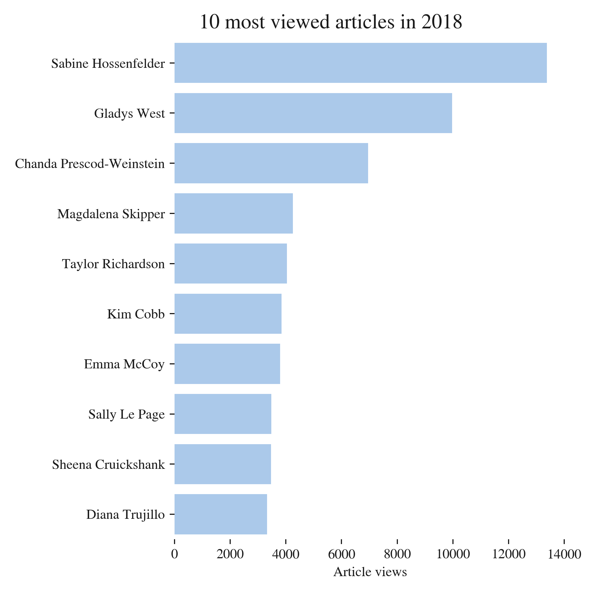

In a [previous post](http://aeturrell.github.io/home//2018/08/18/left-out-of-HE/), I shared links about the predictors for *not* participating in higher education, and about how it is difficult to reach audiences in "remote rural or coastal areas and in former industrial areas, especially in the Midlands" (according to the [Social Mobility Commission](https://www.gov.uk/government/publications/state-of-the-nation-2017)). In this post, I look at another dimension of participation in higher education: gender.

Women are heavily [under-represented](http://www.esa.doc.gov/reports/women-stem-2017-update) in STEM (Science, Technology, Engineering, and Mathematics) subjects. In the UK, they make up just [25%](https://www.stemwomen.co.uk/blog/2018/03/useful-statistics-women-in-stem) of STEM undergraduates but 57% of the [total](https://www.hesa.ac.uk/news/11-01-2018/sfr247-higher-education-student-statistics/subjects) undergraduate population. 

It's little better for economics, as this [article in the Financial Times](https://www.ft.com/content/0e5d27ba-2b61-11e8-9b4b-bc4b9f08f381) (£) shows, and the direction of the trend is worse: in the US, while the fraction of women undergraduates taking STEM subjects has increased, the fraction taking economics has declined. In the UK in 2011/12, it was 28% and [trending downwards](http://www.res.org.uk/view/art2Oct14Features.html). The problems aren't just widely held misapprehensions of [what economics is about](https://www.aeaweb.org/resources/students/what-is-economics), or [#WhatEconomistsDo](https://twitter.com/hashtag/WhatEconomistsDo?src=hash). There is solid analytical work looking at ways in which the culture of economics may be hostile for women too. This work is nicely [summarised by Prof. Diane Coyle](https://www.ft.com/content/6b3cc8be-881e-11e7-afd2-74b8ecd34d3b) (£), again in the Financial Times. Although both economics and STEM have a problem, [I've mused before](http://aeturrell.github.io/home//2017/03/16/trust-me-im-a-doctor/) that economics could perhaps learn from science when it comes to outreach.

# A campaign to inspire women to enter STEM subjects

My Imperial College London physics colleague Dr. Jess Wade ([@jesswade](https://twitter.com/jesswade) on twitter) has come up with a novel way to help inspire more women to enter STEM subjects. She has been busily and heroically writing Wikipedia articles on women scientists of note since 2016. As [she says](https://www.theguardian.com/education/2018/jul/24/academic-writes-270-wikipedia-pages-year-female-scientists-noticed),
>>"Wikipedia is a really great way to engage people in this mission because the more you read about these sensational women, the more you get so motivated and inspired by their personal stories."                  - Dr. Jess Wade


Picked at random, here is the site of one of those of women whose Wikipedia page Jess has created: [Frances Pleasonton](https://en.wikipedia.org/wiki/Frances_Pleasonton), who worked on neutron decay.

What I think is most powerful about Jess' approach is that it has huge reach, because Wikipedia has huge reach. Normally, it's nigh on impossible to measure the impacts of outreach beyond a questionnaire issued at the end of an event. The audiences who attend science outreach events are typically self-selected, and they are rarely, if ever, followed over time to see if their relationship with science changes after the event.

Discussing her approach on BBC Radio 4's Inside Science, Jess expressed her frustrations at well-meaning but likely ineffective outreach programmes which are costly and may do little to reach, or inspire, their intended audience. As was also noted on the programme, scientists can be endlessly methodical in the lab but - when it comes to outreach - their embrace of the scientific method could be better, and outreach programmes need to be better evaluated. Economists could definitely help here.


What is very cool about Jess' campaign is that it *is* possible to get an idea, a rough one at least, of its impact. So just how huge is the reach of this campaign? Let's find out.

---

### Estimating the reach of Wikipedia pages

*Feel free to skip this section if you're not interested in the details of how the data were collected.*

Wikipedia tracks page views, literally the number of times a wiki page has been requested. It's not a perfect measure of the number of people viewing a webpage (you can find more info on the influences [here](https://en.wikipedia.org/wiki/Wikipedia:Pageview_statistics)) as some people are likely to be repeat visitors. Also, if an article is contentious, Wikipedia editors may visit it a lot. The [debated page](https://www.haaretz.com/world-news/.premium-the-15-most-controversial-wikipedia-pages-of-2017-1.5730022) on Stanley Kubrick, for example, has had [396 edits by 203 editors since 2017](https://tools.wmflabs.org/pageviews/?project=en.wikipedia.org&platform=all-access&agent=user&start=2017-01&end=2018-07&pages=Stanley_Kubrick) (at the time of checking). 

So page views aren't perfect, but they're likely to be a good order of magnitude indicator of the number of people who have viewed a page. 

To get all of the stats for the pages, I found Jess' editor page, which includes an option to show all newly created pages. With some data wrangling via the  ``beautifulsoup`` and ``pandas`` python packages, I obtained a list of people for whom pages were created. There may be a few extra pages which are not individuals included in error here, and perhaps some missing - but the wrangling should deliver most of them. 

 With the data on the names of the pages collected, I grabbed the page views using the handy [wiki page view API](https://wikitech.wikimedia.org/wiki/Analytics/AQS/Pageviews) and the ```requests``` python package. Here's a snippet of the page views data table:

| article    | Willetta_Greene-Johnson | Xiangqian_Jiang | Yewande_Akinola |
|------------------|-------------------------|-----------------|-----------------|
| date       |                         |                 |                 |
| 2017-12-01 | 0.0                     | 0.0             | 0.0             |
| 2018-01-01 | 0.0                     | 0.0             | 0.0             |
| 2018-02-01 | 0.0                     | 0.0             | 167.0           |
| 2018-03-01 | 0.0                     | 26.0            | 248.0           |
| 2018-04-01 | 0.0                     | 8.0             | 282.0           |
| 2018-05-01 | 130.0                   | 15.0            | 152.0           |

I used ```matplotlib``` and ```seaborn``` to show the results.

---

# Impact of the campaign

So: how many people has Jess helped reach information on women in STEM? Over 200,000. This is simply astonishing. 


The blue line shows the cumulative total number of page views of all pages. The green lines show just how much hard work this has been - there is one for every individual page created. I've put in a few of the scientists' names. Note that the page views data lag a bit behind the page creations. 

To put the total number of views into some sort of context, the Royal Society [Summer Science Exhibition](https://royalsociety.org/science-events-and-lectures/2018/summer-science-exhibition/), which I ran a [stand](http://sse.royalsociety.org/2014/heart-of-the-sun/) at in 2014, gets around 12,000 visitors per year. Another comparison is that [there were fewer than 100,000](https://www.universitiesuk.ac.uk/facts-and-stats/data-and-analysis/Documents/facts-and-figures-2016.pdf) undergraduates studying physical sciences in the UK in 2014-2015. So this is genuinely reaching an amazing number of people.

In the figure below, you can see a few of the most popular pages for 2018 so far:




It's hard to know who is looking at these pages but it's certain that they wouldn't have been if Jess hadn't created them (and inspired others to do the same). As well as Dr. Stuart Higgins' [Science in the Supermarket](http://www.superscience.org.uk/) from my [previous post](http://aeturrell.github.io/home//2018/08/18/left-out-of-HE/) I think this is a great example of how innovative outreach can be more effective in reaching audiences.